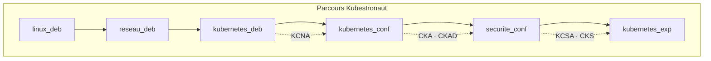
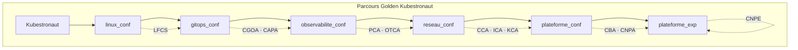
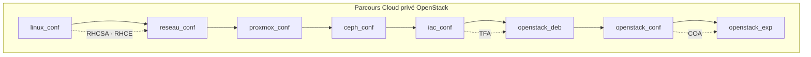
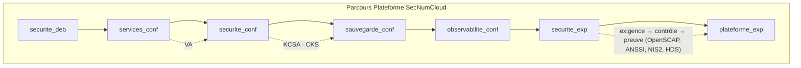
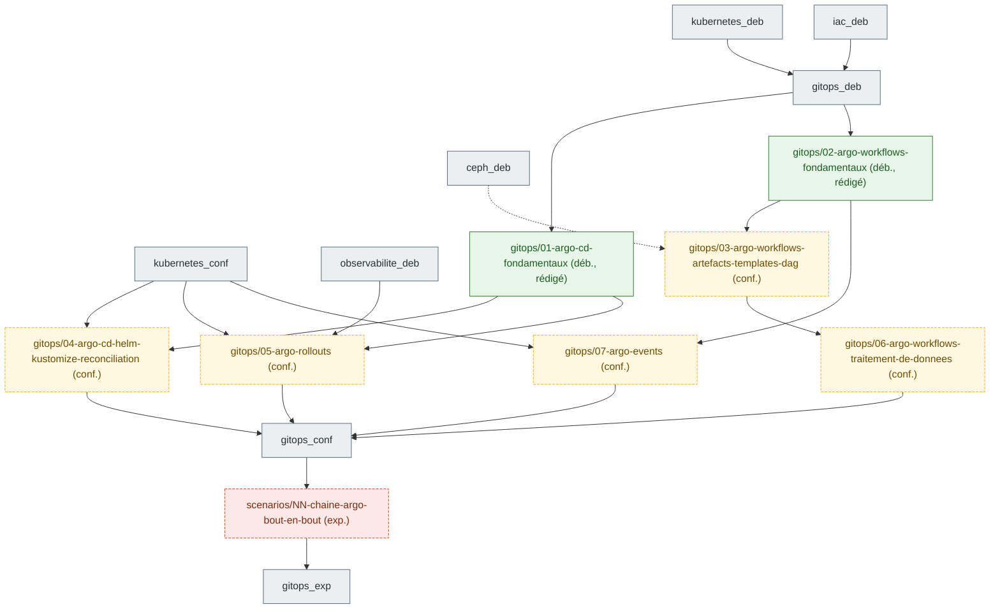
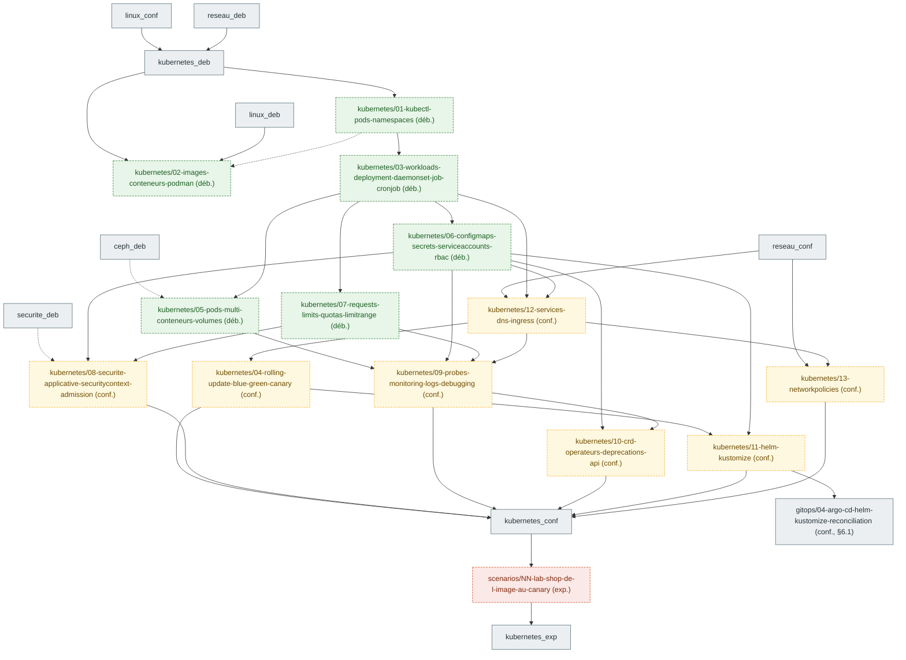

# Graphe de prérequis entre chapitres

Les nœuds de référence sont des **domaines × niveaux** (§2). Les chapitres planifiés par une cartographie de
certification apparaissent en §6 sous la forme `<domaine>/<slug>` et sont rattachés aux nœuds de référence.
Chaque chapitre rédigé s'y rattache par son front matter (`domaine`, `niveau`, `prerequis`) et ajoute
ses propres arêtes. Règle de `CLAUDE.md` : jamais de saut direct débutant → expert.

## 1. Domaines

| Domaine | Clé | Noyau / extension | Certifications principales |
|---|---|---|---|
| Linux | `linux` | noyau | LFCS, RHCSA, RHCE |
| Réseau | `reseau` | noyau | CCA, CKA, COA |
| Proxmox / KVM | `proxmox` | noyau | — (socle du lab) |
| Ceph | `ceph` | noyau | COA (stockage), CKA (CSI) |
| Kubernetes | `kubernetes` | noyau | KCNA, CKA, CKAD, CKS, CCA, ICA, KCA |
| Infrastructure as code | `iac` | noyau | TFA, RHCE (Ansible) |
| GitOps | `gitops` | noyau | CGOA, CAPA |
| Observabilité | `observabilite` | noyau | PCA, OTCA |
| Sécurité | `securite` | noyau | KCSA, CKS, VA, KCA |
| Sauvegarde et données | `sauvegarde` | noyau | CKA (Velero, CSI), COA |
| OpenStack | `openstack` | extension | COA |
| Services de base (DNS, PKI, IdP, NTP, NetBox) | `services` | extension | RHCE, LFCS |
| Plateforme (mesh, Backstage, opérateurs, Kafka, IA sur CPU) | `plateforme` | extension | ICA, CBA, CNPA, CNPE |

## 2. Graphe domaines × niveaux

Convention des nœuds : `<domaine>_<niveau>` avec `deb` (débutant), `conf` (confirmé), `exp` (expert).
Arête pleine = prérequis obligatoire ; arête pointillée = recommandé.

```mermaid
flowchart TB
  classDef deb fill:#e8f5e9,stroke:#2e7d32,color:#1b5e20
  classDef conf fill:#fff8e1,stroke:#f9a825,color:#6d4c00
  classDef exp fill:#fbe9e7,stroke:#d84315,color:#7f2a0f

  subgraph L1[Débutant]
    direction LR
    linux_deb[Linux]:::deb
    reseau_deb[Réseau]:::deb
    proxmox_deb[Proxmox / KVM]:::deb
    iac_deb[IaC]:::deb
    kubernetes_deb[Kubernetes]:::deb
    ceph_deb[Ceph]:::deb
    gitops_deb[GitOps]:::deb
    observabilite_deb[Observabilité]:::deb
    securite_deb[Sécurité]:::deb
    sauvegarde_deb[Sauvegarde]:::deb
    services_deb[Services de base]:::deb
    openstack_deb[OpenStack]:::deb
    plateforme_deb[Plateforme]:::deb
  end

  subgraph L2[Confirmé]
    direction LR
    linux_conf[Linux]:::conf
    reseau_conf[Réseau]:::conf
    proxmox_conf[Proxmox / KVM]:::conf
    iac_conf[IaC]:::conf
    kubernetes_conf[Kubernetes]:::conf
    ceph_conf[Ceph]:::conf
    gitops_conf[GitOps]:::conf
    observabilite_conf[Observabilité]:::conf
    securite_conf[Sécurité]:::conf
    sauvegarde_conf[Sauvegarde]:::conf
    services_conf[Services de base]:::conf
    openstack_conf[OpenStack]:::conf
    plateforme_conf[Plateforme]:::conf
  end

  subgraph L3[Expert]
    direction LR
    linux_exp[Linux]:::exp
    reseau_exp[Réseau]:::exp
    proxmox_exp[Proxmox / KVM]:::exp
    iac_exp[IaC]:::exp
    kubernetes_exp[Kubernetes]:::exp
    ceph_exp[Ceph]:::exp
    gitops_exp[GitOps]:::exp
    observabilite_exp[Observabilité]:::exp
    securite_exp[Sécurité]:::exp
    sauvegarde_exp[Sauvegarde]:::exp
    services_exp[Services de base]:::exp
    openstack_exp[OpenStack]:::exp
    plateforme_exp[Plateforme]:::exp
  end

  %% Progression intra-domaine (jamais de saut débutant -> expert)
  linux_deb --> linux_conf --> linux_exp
  reseau_deb --> reseau_conf --> reseau_exp
  proxmox_deb --> proxmox_conf --> proxmox_exp
  iac_deb --> iac_conf --> iac_exp
  kubernetes_deb --> kubernetes_conf --> kubernetes_exp
  ceph_deb --> ceph_conf --> ceph_exp
  gitops_deb --> gitops_conf --> gitops_exp
  observabilite_deb --> observabilite_conf --> observabilite_exp
  securite_deb --> securite_conf --> securite_exp
  sauvegarde_deb --> sauvegarde_conf --> sauvegarde_exp
  services_deb --> services_conf --> services_exp
  openstack_deb --> openstack_conf --> openstack_exp
  plateforme_deb --> plateforme_conf --> plateforme_exp

  %% Prérequis inter-domaines, niveau débutant
  linux_deb --> reseau_deb
  linux_deb --> proxmox_deb
  linux_deb --> iac_deb
  reseau_deb --> proxmox_deb
  proxmox_deb --> kubernetes_deb
  linux_conf --> kubernetes_deb
  reseau_deb --> kubernetes_deb
  linux_conf --> ceph_deb
  proxmox_deb --> ceph_deb
  kubernetes_deb --> gitops_deb
  iac_deb --> gitops_deb
  kubernetes_deb --> observabilite_deb
  linux_deb --> securite_deb
  linux_deb --> sauvegarde_deb
  linux_conf --> services_deb
  reseau_conf --> services_deb
  linux_conf --> openstack_deb
  reseau_conf --> openstack_deb
  proxmox_conf --> openstack_deb
  ceph_deb -.-> openstack_deb
  kubernetes_conf --> plateforme_deb
  gitops_deb --> plateforme_deb

  %% Prérequis inter-domaines, niveaux confirmé et expert
  reseau_conf --> kubernetes_conf
  ceph_conf -.-> kubernetes_conf
  kubernetes_conf --> securite_conf
  services_deb --> securite_conf
  kubernetes_conf --> sauvegarde_conf
  ceph_conf --> sauvegarde_conf
  observabilite_conf --> plateforme_conf
  securite_conf --> plateforme_conf
  iac_conf --> openstack_conf
  reseau_exp -.-> openstack_exp
  securite_exp -.-> plateforme_exp
  proxmox_exp -.-> reseau_exp
```

## 3. Parcours nommés

Chaque parcours est une suite ordonnée de nœuds du graphe, fermée par des jalons d'examen (voir `docs/roadmap.md` §7).
Le détail chapitre par chapitre sera ajouté quand les chapitres existeront.

## 4. Tableau de correspondance parcours → certifications

| Parcours | Domaines traversés | Certifications (ordre de passage) | Durée de validité à surveiller |
|---|---|---|---|
| Kubestronaut | linux, reseau, kubernetes, securite | KCNA → CKA → CKAD → KCSA → CKS | CKA/CKAD/CKS : 2 ans |
| Golden Kubestronaut | + linux, gitops, observabilite, reseau, plateforme | LFCS → PCA → OTCA → CGOA → CAPA → CCA → ICA → KCA → CBA → CNPA → CNPE | tout valide en même temps |
| Cloud privé OpenStack | linux, reseau, proxmox, ceph, iac, openstack | RHCSA → RHCE → TFA → COA | RHCSA/RHCE : 3 ans |
| Plateforme SecNumCloud | securite, services, sauvegarde, observabilite, plateforme | VA → KCSA → CKS (+ conformité outillée, sans certification) | — |

## 5. Règles d'édition du graphe

- Un chapitre ajoute ses nœuds sous la forme `<domaine>/<slug>` et ne relie que des nœuds existants.
- Une cartographie de certification (`prompts/01-cartographie-certification.md`) ajoute ses chapitres **planifiés**
  en §6 avec le statut `planifié` ; la PR du chapitre passe le nœud en `rédigé` et déplace ses arêtes si besoin.
- Une arête inter-domaines nouvelle se justifie en une ligne dans la PR du chapitre.
- Le graphe est régénéré, pas retouché à la main, dès qu'un script `scripts/prerequis.py` existera (à créer).

## 6. Chapitres planifiés par certification

Nœuds `<domaine>/<slug>` ajoutés par les cartographies. Statut `planifié` tant que le chapitre n'existe pas,
`rédigé` ensuite (le nœud prend la couleur de son niveau).
Arête pleine = prérequis obligatoire ; arête pointillée = recommandé.

### 6.1 CAPA (certifs/CAPA/objectifs.md, 2026-10-02)

Sept fiches `gitops` et un scénario. Arêtes inter-domaines nouvelles, justifiées dans `certifs/CAPA/objectifs.md` §4 :
`observabilite_deb` → Argo Rollouts (AnalysisTemplate Prometheus), `ceph_deb` ⇢ Argo Workflows artefacts (bucket S3 via RGW).

| Nœud | Niveau | Statut | Certifications | Prérequis |
|---|---|---|---|---|
| `gitops/01-argo-cd-fondamentaux` | débutant | rédigé (brouillon) | CAPA-02-01 à 02-03, CGOA-01-02 à 01-06, 01-09, 02-03, 02-04 | `kubernetes_deb`, `iac_deb` |
| `gitops/04-argo-cd-helm-kustomize-reconciliation` | confirmé | planifié | CAPA-02-04, 02-05 | `gitops/01-argo-cd-fondamentaux`, `kubernetes_conf` |
| `gitops/02-argo-workflows-fondamentaux` | débutant | rédigé (brouillon) | CAPA-01-01, 01-04, CGOA-03-04 | `kubernetes_deb` ; `gitops/01-argo-cd-fondamentaux` recommandé |
| `gitops/03-argo-workflows-artefacts-templates-dag` | confirmé | planifié | CAPA-01-02, 01-03, 01-05 | `gitops/02-argo-workflows-fondamentaux`, `ceph_deb` (recommandé) |
| `gitops/06-argo-workflows-traitement-de-donnees` | confirmé | planifié | CAPA-01-06 | `gitops/03-argo-workflows-artefacts-templates-dag` |
| `gitops/05-argo-rollouts` | confirmé | planifié | CAPA-03-01 à 03-03 | `gitops/01-argo-cd-fondamentaux`, `observabilite_deb`, `kubernetes_conf` |
| `gitops/07-argo-events` | confirmé | planifié | CAPA-04-01, 04-02 | `gitops/02-argo-workflows-fondamentaux`, `kubernetes_conf` |
| `scenarios/NN-chaine-argo-bout-en-bout` | expert | planifié | CAPA (16 compétences), CGOA-04-01 à 04-04 | les sept fiches ci-dessus |

### 6.2 CKAD (certifs/CKAD/objectifs.md, 2026-10-02)

Treize fiches `kubernetes` (sept débutant, six confirmé) et un scénario. `fiches/kubernetes/` était vide : ces nœuds forment
le contenu de `kubernetes_deb` et de `kubernetes_conf`, partagé avec CKA et KCNA (la cartographie CKA réutilise les nœuds
communs et prend les numéros suivants). Arêtes inter-domaines nouvelles, justifiées dans `certifs/CKAD/objectifs.md` §4 :
`securite_deb` ⇢ K8 (capabilities, seccomp côté hôte), `ceph_deb` ⇢ K5 (variante CSI Rook),
K11 → `gitops/04-argo-cd-helm-kustomize-reconciliation` (Argo CD rend des sources Helm/Kustomize, il faut les connaître avant).

| Nœud | Niveau | Statut | Certifications | Prérequis |
|---|---|---|---|---|
| `kubernetes/01-kubectl-pods-namespaces` | débutant | planifié | CKAD-01-02 (Pods), 03-03, 03-04 ; KCNA-01-01 | `linux_conf`, `reseau_deb` |
| `kubernetes/02-images-conteneurs-podman` | débutant | planifié | CKAD-01-01 ; CKS-05-01, KCNA-01-04 | `linux_deb` ; K1 recommandé |
| `kubernetes/03-workloads-deployment-daemonset-job-cronjob` | débutant | planifié | CKAD-01-02 ; CKA-02-04 | K1 |
| `kubernetes/05-pods-multi-conteneurs-volumes` | débutant | planifié | CKAD-01-03, 01-04 ; CKA-01-02, 01-03 | K3 ; `ceph_deb` recommandé (variante Rook) |
| `kubernetes/06-configmaps-secrets-serviceaccounts-rbac` | débutant | planifié | CKAD-04-02 (partiel), 04-05, 04-06, 04-07 ; CKA-02-02, CKS-02-01, 02-02, 04-02 | K3 |
| `kubernetes/07-requests-limits-quotas-limitrange` | débutant | planifié | CKAD-04-03, 04-04 ; CKA-02-05 | K3 |
| `kubernetes/04-rolling-update-blue-green-canary` | confirmé | planifié | CKAD-02-01, 02-02 ; CKA-02-01 | K3, K12 |
| `kubernetes/08-securite-applicative-securitycontext-admission` | confirmé | planifié | CKAD-04-02 (admission), 04-08 ; CKS-03-04, 04-01 | K6, K7 ; `securite_deb` recommandé |
| `kubernetes/09-probes-monitoring-logs-debugging` | confirmé | planifié | CKAD-03-02 à 03-05 ; CKA-04 | K5, K6, K7, K12 |
| `kubernetes/10-crd-operateurs-deprecations-api` | confirmé | planifié | CKAD-03-01, 04-01 | K6, K9 |
| `kubernetes/11-helm-kustomize` | confirmé | planifié | CKAD-02-03, 02-04 ; CAPA-02-04 (prépare `gitops/04`) | K4, K6 |
| `kubernetes/12-services-dns-ingress` | confirmé | planifié | CKAD-05-02, 05-03 ; CKA-03-03, 03-05, 03-06, CKS-01-03 | K3, K6, `reseau_conf` |
| `kubernetes/13-networkpolicies` | confirmé | planifié | CKAD-05-01 ; CKA-03-02, CKS-01-01 | K12, `reseau_conf` |
| `scenarios/NN-lab-shop-de-l-image-au-canary` | expert | planifié | CKAD (24 compétences) ; CKA-02-01, 03-02, 03-03, CKS-04-01, 05-01 | les treize fiches ci-dessus |
