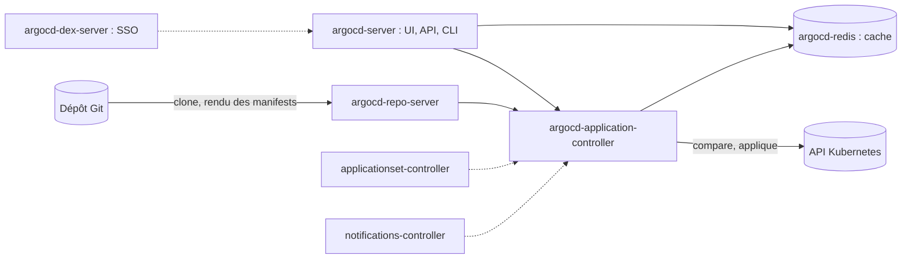

# Argo CD — installer, déclarer une Application, synchroniser

> Niveau **débutant** · durée **5 h** · profil de lab **linux-base** (kind sur une VM ; variante **kubernetes-ha**) ·
> couvre **CAPA-02-01, CAPA-02-02, CAPA-02-03** (+ CGOA-01-02 à 01-06, 01-09, 02-03, 02-04, à confirmer par la cartographie CGOA).

Statut d'exécution de cette version : la session de rédaction n'avait pas de démon Docker, donc pas de cluster `kind`.
Les commandes qui touchent un cluster sont marquées `[non testé : pas de cluster dans la session de rédaction]`.
Ont été exécutés pour de vrai : la lecture de `versions.yaml`, le CLI `argocd` en mode client, l'analyse du manifest
d'installation téléchargé, la validation des manifests du chapitre avec `kubeconform` et les scripts de panne en mode `--reveal`.
Le statut passera à `validé en conditions réelles` après une exécution complète sur le lab.

Plan validé : `docs/plans/gitops-01-argo-cd-fondamentaux.md`. Arbitrages : `DECISIONS.md` (2026-10-02, numérotation, Git du lab, Gateway API).

## Objectifs mesurables

À la fin de cette fiche tu sais :

- installer Argo CD depuis les manifests de la version `argo_cd` de `versions.yaml` et te connecter avec le CLI en moins de 20 min ;
- déclarer un `AppProject` et une `Application` vers un dépôt Git et obtenir `Synced` / `Healthy` en moins de 10 min ;
- provoquer un drift manuel, le lire avec `argocd app diff`, le corriger dans les deux sens en moins de 5 min ;
- diagnostiquer une Application `OutOfSync`, `Degraded` ou en `ComparisonError` en moins de 10 min ;
- revenir à la révision précédente avec `argocd app history` et `argocd app rollback` en moins de 5 min ;
- expliquer sans notes, en trois phrases, les composants d'Argo CD et la différence sync manuelle / automatique / `prune` / `selfHeal`.

## Section 1 — Installer et comprendre Argo CD

Chaque section suit le cycle ci-dessous, dans cet ordre, sans en sauter.

### Concept (court)

Argo CD est un contrôleur Kubernetes qui compare en continu l'état **désiré** (des manifests dans Git) à l'état **vivant**
(les objets du cluster) et qui sait appliquer le premier sur le second. C'est le modèle GitOps *pull* : rien ne pousse
vers le cluster, c'est le cluster qui tire.



Trois CRD portent tout : `Application` (une source Git → une destination), `AppProject` (ce qu'une Application a le droit
de faire) et `ApplicationSet` (génère des Applications, fiche 04). Manipulation dans les 10 lignes : on installe.

### Démo guidée

Sur la VM `linux-base` avec Docker installé. On lit les versions dans `versions.yaml`, jamais en dur.

```bash
cd ~/WorkbookDevops
ARGOCD_VERSION=$(yq -r '.components.argo_cd.version' versions.yaml)
KIND_VERSION=$(yq -r '.components.kind.version' versions.yaml)
echo "argo_cd=$ARGOCD_VERSION kind=$KIND_VERSION"
```

Sortie obtenue (exécuté) :

```text
argo_cd=3.5.3 kind=0.33.0
```

Installation de `kind` et création du cluster. L'image de nœud par défaut est celle livrée avec cette version de `kind`
(voir « Points de vigilance » en fin de fiche pour l'écart avec la clé `kubernetes`).

```bash
curl -sSL -o /usr/local/bin/kind "https://github.com/kubernetes-sigs/kind/releases/download/v${KIND_VERSION}/kind-linux-amd64"
chmod +x /usr/local/bin/kind
kind create cluster --name argocd-lab
kubectl cluster-info --context kind-argocd-lab
```

`[non testé : pas de cluster dans la session de rédaction]` — le téléchargement et `kind version` ont été exécutés et
renvoient bien `kind v0.33.0`.

Installation d'Argo CD depuis le manifest **versionné** (la doc officielle pointe sur `stable`, on ne suit jamais `stable`).

```bash
kubectl create namespace argocd
kubectl apply -n argocd --server-side --force-conflicts \
  -f "https://raw.githubusercontent.com/argoproj/argo-cd/v${ARGOCD_VERSION}/manifests/install.yaml"
kubectl -n argocd rollout status statefulset/argocd-application-controller --timeout=180s
kubectl -n argocd rollout status deploy/argocd-server --timeout=180s
kubectl -n argocd get pods
```

`[non testé : pas de cluster dans la session de rédaction]`. Ce que le manifest contient, lu avec `yq` sur le fichier
téléchargé (exécuté) :

```bash
curl -sSL -o /tmp/install.yaml "https://raw.githubusercontent.com/argoproj/argo-cd/v${ARGOCD_VERSION}/manifests/install.yaml"
yq -r 'select(.kind=="Deployment" or .kind=="StatefulSet") | .kind + " " + .metadata.name' /tmp/install.yaml
yq -r 'select(.kind=="CustomResourceDefinition") | .metadata.name' /tmp/install.yaml
```

```text
Deployment argocd-applicationset-controller
Deployment argocd-dex-server
Deployment argocd-notifications-controller
Deployment argocd-redis
Deployment argocd-repo-server
Deployment argocd-server
StatefulSet argocd-application-controller
applications.argoproj.io
applicationsets.argoproj.io
appprojects.argoproj.io
```

Sept charges de travail, trois CRD. Retiens que le contrôleur est un `StatefulSet` (sharding par cluster) et que
`argocd-server` n'est que la façade : si tu le coupes, la réconciliation continue.

Le CLI, à la même version que le serveur, puis la première connexion par `port-forward`.

```bash
curl -sSL -o /usr/local/bin/argocd \
  "https://github.com/argoproj/argo-cd/releases/download/v${ARGOCD_VERSION}/argocd-linux-amd64"
chmod +x /usr/local/bin/argocd
argocd version --client
```

Sortie obtenue (exécuté) :

```text
argocd: v3.5.3+c9c369e
  BuildDate: 2026-09-14T07:38:20Z
  GitCommit: c9c369efcc5b2a0bd720803f8d14a1c3eaddf579
  GitTreeState: clean
  GoVersion: go1.26.4
  Compiler: gc
  Platform: linux/amd64
```

```bash
kubectl port-forward svc/argocd-server -n argocd 8080:443 >/tmp/pf.log 2>&1 &
ARGOCD_PW=$(argocd admin initial-password -n argocd | head -1)
argocd login localhost:8080 --username admin --password "$ARGOCD_PW" --insecure
argocd version          # client ET serveur cette fois
argocd account update-password
kubectl -n argocd delete secret argocd-initial-admin-secret
```

`[non testé : pas de cluster dans la session de rédaction]`. Le secret initial ne sert qu'à la première connexion ;
la doc officielle demande de le supprimer une fois le mot de passe changé.

### Exercice autonome

1. Expose l'UI autrement que par `port-forward` : sur `kind`, passe le Service `argocd-server` en `NodePort` et
   ouvre l'UI depuis la VM ; sur `kubernetes-ha`, utilise le manifest `fiches/gitops/01-argo-cd-fondamentaux/manifests/variante-gateway-argocd.yaml`
   (Gateway API Cilium + certificat cert-manager de la CA interne, hôte `argocd.apps.lab.home.arpa`).
2. Explique en une phrase par composant à quoi servent `argocd-repo-server`, `argocd-application-controller`,
   `argocd-server` et `argocd-redis`, puis vérifie ta réponse en coupant `argocd-server` 60 s : l'Application
   créée en section 2 continue-t-elle d'être réconciliée ?
3. Trouve dans `argocd-cm` la méthode de suivi des ressources par défaut en 3.x et explique ce qu'elle change par
   rapport aux labels.

Compétences couvertes : `CAPA-02-01`, `CGOA-01-06`.

### Break-fix

Script : `break/gitops/01-argocd-repo-server-down.sh` — injecte la panne, `--undo` la retire, `--reveal` l'explique.

Symptôme : l'UI répond, `argocd app get guestbook --refresh` ne rend plus la main ou renvoie une erreur de
comparaison ; `argocd app manifests guestbook` échoue. Le cluster, lui, va bien.

### Défi chronométré

Depuis une VM vierge (cluster `kind` supprimé avec `kind delete cluster --name argocd-lab`) : cluster, Argo CD à la
version `argo_cd`, CLI connecté, mot de passe admin changé, secret initial supprimé. **20 min.**
Critère : `argocd version` affiche un bloc `argocd-server:` à la même version que le client et
`kubectl -n argocd get secret argocd-initial-admin-secret` renvoie `NotFound`.

## Section 2 — Déclarer un AppProject et une Application

### Concept (court)

Une `Application` dit **quoi** (`source` : dépôt, révision, chemin) et **où** (`destination` : cluster, namespace).
Un `AppProject` dit **ce qui est permis** : dépôts sources autorisés, destinations autorisées, kinds autorisés.
Toute Application appartient à un projet ; `default` autorise tout, donc on n'y met rien.
Deux états à lire séparément : **sync** (`Synced` / `OutOfSync` : Git et le cluster disent-ils la même chose ?) et
**health** (`Healthy` / `Progressing` / `Degraded` / `Missing` : les objets vivants vont-ils bien ?).

### Démo guidée

Le projet `lab` autorise deux dépôts (l'exemple officiel et le dépôt du lab) et une seule destination : le cluster
local, dans des namespaces nommés `guestbook` ou `demo-*`.

```yaml
# fiches/gitops/01-argo-cd-fondamentaux/manifests/appproject-lab.yaml
apiVersion: argoproj.io/v1alpha1
kind: AppProject
metadata:
  name: lab
  namespace: argocd
spec:
  description: "Projet du workbook : exemples et dépôt du lab"
  sourceRepos:
    - https://github.com/argoproj/argocd-example-apps.git
    - git@git.lab.home.arpa:/srv/git/gitops-demo.git
  destinations:
    - server: https://kubernetes.default.svc
      namespace: guestbook
    - server: https://kubernetes.default.svc
      namespace: "demo-*"
  clusterResourceWhitelist:
    - group: ""
      kind: Namespace
```

L'Application `guestbook` pointe sur l'exemple officiel. Pas de `syncPolicy.automated` : la sync est manuelle.

```yaml
# fiches/gitops/01-argo-cd-fondamentaux/manifests/application-guestbook.yaml
apiVersion: argoproj.io/v1alpha1
kind: Application
metadata:
  name: guestbook
  namespace: argocd
spec:
  project: lab
  source:
    repoURL: https://github.com/argoproj/argocd-example-apps.git
    targetRevision: HEAD
    path: guestbook
  destination:
    server: https://kubernetes.default.svc
    namespace: guestbook
  syncPolicy:
    syncOptions:
      - CreateNamespace=true
```

Validation des deux manifests contre les schémas des CRD (exécuté, voir « Points de vigilance » pour la source des schémas) :

```bash
kubeconform -strict -summary \
  -schema-location default \
  -schema-location 'https://raw.githubusercontent.com/datreeio/CRDs-catalog/main/{{.Group}}/{{.ResourceKind}}_{{.ResourceAPIVersion}}.json' \
  fiches/gitops/01-argo-cd-fondamentaux/manifests/
```

```text
Summary: 6 resources found in 4 files - Valid: 6, Invalid: 0, Errors: 0, Skipped: 0
```

Application et première synchronisation :

```bash
kubectl apply -f fiches/gitops/01-argo-cd-fondamentaux/manifests/appproject-lab.yaml
kubectl apply -f fiches/gitops/01-argo-cd-fondamentaux/manifests/application-guestbook.yaml
argocd app get guestbook            # attendu : Sync Status OutOfSync, Health Missing
argocd app sync guestbook
argocd app wait guestbook --sync --health --timeout 120
argocd app get guestbook            # attendu : Synced, Healthy
argocd app resources guestbook      # un Deployment et un Service dans guestbook
argocd app manifests guestbook | head -20
kubectl -n guestbook get deploy,svc
```

`[non testé : pas de cluster dans la session de rédaction]`. La même Application en une ligne de CLI, pour l'examen
qui cite souvent cette forme (l'aide du CLI a été exécutée, les drapeaux sont exacts) :

```bash
argocd app create guestbook --project lab \
  --repo https://github.com/argoproj/argocd-example-apps.git --path guestbook \
  --dest-server https://kubernetes.default.svc --dest-namespace guestbook \
  --sync-option CreateNamespace=true
```

### Exercice autonome

1. Crée un dépôt Git du lab accessible en SSH. Sur le lab complet, c'est un dépôt bare sur `core-jump01`
   derrière `git.lab.home.arpa` (DECISIONS.md) ; sur la VM `kind`, héberge-le sur la VM elle-même et remplace
   l'hôte par son adresse. Génère une clé dédiée à Argo CD, enregistre la clé d'hôte avec `argocd cert add-ssh --batch`
   puis le dépôt avec `argocd repo add … --ssh-private-key-path`. Pousse une copie des manifests `guestbook`
   dans un dossier `demo/` en changeant le nom de l'application en `demo-ui`.
2. Déclare `lab-demo` dans le projet `lab`, destination `demo-web`, à partir du manifest
   `fiches/gitops/01-argo-cd-fondamentaux/manifests/application-lab-demo.yaml`. Obtiens `Synced` / `Healthy`.
3. Modifie la destination en `prod-web`. Lis l'erreur exacte dans `argocd app get lab-demo`. Corrige en modifiant
   le **projet**, pas l'Application, puis remets `demo-web`.

Compétences couvertes : `CAPA-02-03`, `CGOA-01-02`, `CGOA-01-03`.

### Break-fix

Script : `break/gitops/01-argocd-repo-credentials.sh` — injecte la panne, `--undo` la retire, `--reveal` l'explique.

Symptôme : `lab-demo` passe en `Unknown` avec un `ComparisonError` ; `argocd app get lab-demo --refresh` parle
d'authentification. `guestbook`, lui, se synchronise toujours.

### Défi chronométré

Un dépôt du lab vide, un dossier `demo/` à y pousser, une Application `lab-demo` dans le projet `lab` : obtenir
`Synced` / `Healthy`. **10 min.** Critère :
`argocd app get lab-demo -o json | jq -r '.status.sync.status + " " + .status.health.status'` renvoie `Synced Healthy`.

## Section 3 — Synchroniser, détecter le drift, revenir en arrière

### Concept (court)

Sans `automated`, Argo CD **constate** l'écart et attend. Avec `automated`, il **applique** Git dès qu'un commit
arrive. Deux options changent tout :

- `prune` : supprime du cluster ce qui a disparu de Git (désactivé par défaut, c'est une sécurité) ;
- `selfHeal` : réapplique Git quand quelqu'un modifie le cluster à la main (sinon un drift manuel reste `OutOfSync`).

`rollback` rejoue une révision déjà déployée ; il refuse de fonctionner tant que `automated` est actif,
parce que la sync automatique le défairait aussitôt.

### Démo guidée

Le drift manuel, lu puis corrigé dans les deux sens.

```bash
kubectl -n guestbook scale deployment guestbook-ui --replicas=3
argocd app get guestbook                      # attendu : OutOfSync (Deployment), Healthy
argocd app diff guestbook ; echo "exit=$?"    # exit 1 : il y a un diff (0 = aucun, 2 = erreur)
argocd app sync guestbook                     # Git gagne : replicas revient à 1
kubectl -n guestbook get deploy guestbook-ui
```

`[non testé : pas de cluster dans la session de rédaction]`. Les codes de sortie de `argocd app diff` viennent de
l'aide du CLI (exécutée). Maintenant l'automatique, avec et sans `selfHeal` :

```bash
argocd app set guestbook --sync-policy automated
kubectl -n guestbook scale deployment guestbook-ui --replicas=3
sleep 30 ; argocd app get guestbook           # attendu : toujours OutOfSync : pas de selfHeal, pas de nouveau commit
argocd app set guestbook --self-heal
sleep 30 ; argocd app get guestbook           # attendu : Synced, replicas=1 : le drift a été réparé
kubectl -n argocd get application guestbook -o jsonpath='{.spec.syncPolicy}{"\n"}'
```

`[non testé : pas de cluster dans la session de rédaction]`. Historique et retour arrière : on coupe l'automatique
d'abord, sinon `rollback` est refusé.

```bash
argocd app history guestbook
argocd app set guestbook --sync-policy manual
argocd app rollback guestbook                 # sans ID : la révision précédente
argocd app history guestbook
argocd app get guestbook
```

`[non testé : pas de cluster dans la session de rédaction]`.

### Exercice autonome

Sur `lab-demo` (ton dépôt, tu peux pousser) :

1. Supprime `demo/demo-ui-svc.yaml` dans Git, pousse, observe `lab-demo` sans `prune` puis avec `--auto-prune`.
   Note ce que montre `argocd app get` dans les deux cas et où le Service a fini.
2. Pousse une image inexistante (`gcr.io/google-samples/gb-frontend:does-not-exist`) et un
   `progressDeadlineSeconds: 30` sur le Deployment. Observe la séquence `Progressing` → `Degraded`.
   Répare **par Git** (`git revert`), pas par `kubectl`.
3. Explique pourquoi `argocd app rollback` n'est pas la bonne réponse GitOps au point 2, et dans quel cas il l'est.

Compétences couvertes : `CAPA-02-02`, `CGOA-01-04`, `CGOA-01-05`, `CGOA-01-09`, `CGOA-02-03`, `CGOA-02-04`.

### Break-fix

Script : `break/gitops/01-argocd-app-degraded.sh` — injecte la panne, `--undo` la retire, `--reveal` l'explique.

Symptôme : `guestbook` est `OutOfSync` et `Degraded`, un pod de `guestbook-ui` boucle en `ImagePullBackOff`,
et une sync manuelle ne suffit pas à tout remettre d'équerre.

Panne optionnelle : `break/gitops/01-argocd-destination-forbidden.sh` — `lab-demo` refuse de se synchroniser
avec un message qui parle de destination et de projet.

### Défi chronométré

Panne injectée à l'aveugle parmi les quatre scripts de la fiche. Diagnostic et correction. **10 min.**
Critère : `argocd app list -o json | jq -r '.[] | .metadata.name + " " + .status.sync.status + " " + .status.health.status'`
ne renvoie que des lignes `Synced Healthy`.

## Checklist de maîtrise

À cocher honnêtement, en conditions réelles (terminal seul, documentation officielle, minuteur).

- [ ] Je sais installer Argo CD à la version de `versions.yaml` et me connecter avec le CLI en moins de 20 min
- [ ] Je sais écrire un `AppProject` restrictif et une `Application` et obtenir `Synced` / `Healthy` en moins de 10 min
- [ ] Je sais lire un drift avec `argocd app diff` et le corriger dans les deux sens en moins de 5 min
- [ ] Je sais diagnostiquer une Application `Degraded`, `OutOfSync` ou en `ComparisonError` en moins de 10 min
- [ ] Je sais revenir à la révision précédente en moins de 5 min, et je sais pourquoi il faut couper `automated` avant
- [ ] Je sais expliquer les sept charges de travail d'Argo CD et les deux états sync / health en 3 phrases sans notes

## Points de vigilance (versions)

- `argo_cd` 3.5.3 est testé par le projet sur Kubernetes 1.33 à 1.36 (fichier `docs/operator-manual/tested-kubernetes-versions.md`
  du dépôt à la version 3.5.3, lu le 2026-10-02). La clé `kubernetes` de `versions.yaml` est en 1.37 et l'image de nœud par
  défaut de `kind` 0.33.0 est une 1.37.0. Écart accepté pour ce chapitre, à surveiller : si un comportement étrange apparaît,
  recrée le cluster avec l'image 1.36 livrée par la même version de `kind`.
- Argo CD 3.5 embarque **Helm 4** (4.2.1 d'après `hack/tool-versions.sh` à la version 3.5.3) et Kustomize 5.8.1 : cohérent avec
  la décision « Helm 4 partout », légère avance de `versions.yaml` (`helm` 4.3.0) sans impact ici. Les sources Helm sont traitées en fiche 04.
- Depuis la 3.0 : suivi des ressources par **annotation** par défaut (`application.resourceTrackingMethod`), champ `status` ignoré
  dans le diff pour toutes les ressources, RBAC `logs` séparé (sans `logs, get`, pas d'onglet logs). Beaucoup de supports
  d'examen décrivent encore la 2.x : retiens les défauts 3.x.
- Depuis la 3.5 : les dépôts SSH sans identifiants utilisent aussi `argocd-ssh-known-hosts-cm`, d'où `argocd cert add-ssh` dans l'exercice 2.
- Schémas pour `kubeconform` : le catalogue `datreeio/CRDs-catalog` (communautaire) ; en cas d'écart, extraire le schéma depuis
  les CRD du manifest `install.yaml` de la version `argo_cd`.

## Liens

- Solutions (3 indices puis correction commentée) : `solutions/fiches/gitops/01-argo-cd-fondamentaux.md`
- Pannes scriptées : `break/gitops/`
- Flashcards (10 à 20, CSV `question;réponse;tags`) : `revision/flashcards/gitops-01-argo-cd-fondamentaux.csv`
- Mapping certification : `certifs/CAPA/objectifs.md`
- Rappel espacé : séances J+1, J+7, J+30 à noter dans `journal/`
