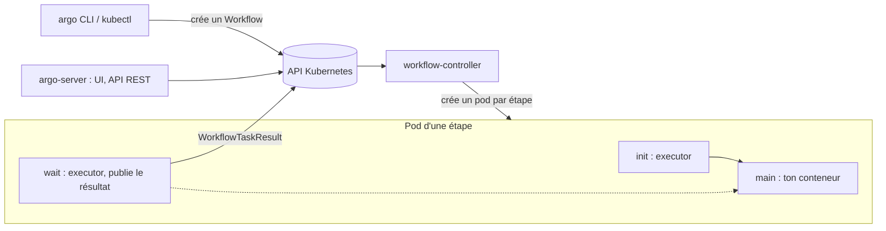

# Argo Workflows — installer, écrire et lancer un premier workflow

> Niveau **débutant** · durée **5 h** · profil de lab **linux-base** (kind sur une VM ; variante **kubernetes-ha**) ·
> couvre **CAPA-01-01, CAPA-01-04** (+ CGOA-03-04, confirmés par `certifs/CGOA/objectifs.md`).

Statut d'exécution de cette version : la session de rédaction n'avait pas de démon Docker, donc pas de cluster `kind`.
Les commandes qui touchent un cluster sont marquées `[non testé : pas de cluster dans la session de rédaction]`.
Ont été exécutés pour de vrai : la lecture de `versions.yaml`, le téléchargement et `argo version` du CLI, l'analyse
du manifest `install.yaml` avec `yq`, `argo lint --offline` sur les six workflows du chapitre, `kubeconform` sur les
dix manifests et la vérification des tags d'images sur Docker Hub. Le statut passera à `validé en conditions réelles`
après une exécution complète sur le lab.

Plan validé : `docs/plans/gitops-02-argo-workflows-fondamentaux.md`. Arbitrages : `DECISIONS.md` (2026-10-02, numérotation,
Gateway API). Indépendant de la fiche 01 : Argo Workflows n'a pas besoin d'Argo CD.

## Objectifs mesurables

À la fin de cette fiche tu sais :

- installer le contrôleur et le serveur Argo Workflows depuis les manifests de la version `argo_workflows` de `versions.yaml`,
  installer le CLI `argo` à la même version et lancer `hello-world` avec succès en moins de 15 min ;
- nommer sans notes les composants (`workflow-controller`, `argo-server`, executor emissary, conteneurs `init` / `wait` / `main`)
  et dire ce que fait chacun en une phrase ;
- écrire un `Workflow` à trois étapes avec `entrypoint`, templates `container` et `script`, `steps` séquentiels et parallèles,
  paramètres d'entrée et de sortie, et le voir `Succeeded` en moins de 10 min ;
- lire l'état d'un workflow avec `argo get`, `argo logs`, `argo watch` et `kubectl get pods`, et retrouver quelle étape a
  échoué et pourquoi en moins de 5 min ;
- piloter le cycle de vie (`submit`, `suspend`, `resume`, `stop`, `terminate`, `retry`, `resubmit`, `delete`) et expliquer
  ce qui distingue `stop` de `terminate` et `retry` de `resubmit` ;
- borner un workflow avec `activeDeadlineSeconds`, `retryStrategy`, `ttlStrategy`, `podGC` et des `resources`, et vérifier
  l'effet de chaque champ par une commande ;
- diagnostiquer un workflow bloqué en `Pending` ou en `Error` (RBAC du ServiceAccount, contrôleur absent, image introuvable)
  en moins de 10 min.

## Section 1 — Installer et comprendre Argo Workflows

Chaque section suit le cycle ci-dessous, dans cet ordre, sans en sauter.

### Concept (court)

Argo Workflows est un moteur d'exécution : tu décris un enchaînement d'étapes dans une ressource `Workflow`, le contrôleur
crée **un pod par étape**, suit son résultat et décide de la suite. C'est un `Job` Kubernetes qui saurait enchaîner,
paralléliser, passer des valeurs d'une étape à l'autre et reprendre après échec. Il ne déploie rien en continu : c'est
l'outil de la CI et du traitement de données, là où Argo CD (fiche 01) est l'outil du déploiement.



Deux charges de travail seulement : `workflow-controller` (le cerveau, il parle à l'API Kubernetes) et `argo-server`
(l'UI et l'API REST, facultatif pour exécuter). Dans chaque pod d'étape, l'**executor emissary** s'injecte en conteneur
`init` et en conteneur `wait` autour de ton conteneur `main` : il capture la sortie, les paramètres et les artefacts, puis
publie un `WorkflowTaskResult` que le contrôleur lit. Manipulation dans les 10 lignes : on installe.

### Démo guidée

Sur la VM `linux-base` avec Docker et `kind` (fiche 01). Les versions viennent de `versions.yaml`, jamais en dur.

```bash
cd ~/WorkbookDevops
ARGO_WF_VERSION=$(yq -r '.components.argo_workflows.version' versions.yaml)
KIND_VERSION=$(yq -r '.components.kind.version' versions.yaml)
echo "argo_workflows=$ARGO_WF_VERSION kind=$KIND_VERSION"
```

Sortie obtenue (exécuté) :

```text
argo_workflows=4.1.4 kind=0.33.0
```

Cluster `kind` : réutilise `argocd-lab` s'il existe (fiche 01), sinon crée-le. Argo Workflows et Argo CD cohabitent sans
conflit, chacun dans son namespace.

```bash
kind get clusters | grep -qx argocd-lab || kind create cluster --name argocd-lab
kubectl cluster-info --context kind-argocd-lab
```

`[non testé : pas de cluster dans la session de rédaction]`. Installation depuis le manifest **versionné** de la release
(jamais `latest`). Depuis la 4.0 les CRD sont complètes, donc trop grosses pour un `kubectl apply` classique : `--server-side`
est obligatoire, la doc d'installation le dit.

```bash
kubectl create namespace argo
kubectl apply -n argo --server-side \
  -f "https://github.com/argoproj/argo-workflows/releases/download/v${ARGO_WF_VERSION}/install.yaml"
kubectl -n argo rollout status deploy/workflow-controller --timeout=180s
kubectl -n argo rollout status deploy/argo-server --timeout=180s
kubectl -n argo get pods
```

`[non testé : pas de cluster dans la session de rédaction]`. Ce que le manifest contient, lu avec `yq` sur le fichier
téléchargé (exécuté) :

```bash
curl -sSL -o /tmp/install.yaml \
  "https://github.com/argoproj/argo-workflows/releases/download/v${ARGO_WF_VERSION}/install.yaml"
yq -r 'select(.kind=="Deployment") | .kind + " " + .metadata.name + " " + .spec.template.spec.containers[0].image' /tmp/install.yaml
yq -r 'select(.kind=="CustomResourceDefinition") | .metadata.name' /tmp/install.yaml
yq -r 'select(.kind=="Deployment" and .metadata.name=="argo-server") | .spec.template.spec.containers[0].args' /tmp/install.yaml
```

```text
Deployment argo-server quay.io/argoproj/argocli:v4.1.4
Deployment workflow-controller quay.io/argoproj/workflow-controller:v4.1.4
clusterworkflowtemplates.argoproj.io
cronworkflows.argoproj.io
workflowartifactgctasks.argoproj.io
workfloweventbindings.argoproj.io
workflows.argoproj.io
workflowtaskresults.argoproj.io
workflowtasksets.argoproj.io
workflowtemplates.argoproj.io
[
  "server"
]
```

Deux Deployments, huit CRD. Retiens `workflows`, `workflowtemplates`, `cronworkflows`, `clusterworkflowtemplates` (les quatre
que tu écris) et `workflowtaskresults` (celle que l'executor écrit pour toi). `argo-server` tourne avec le seul argument
`server` : son mode d'authentification est donc le défaut, `client`, qui exige un jeton Kubernetes pour l'UI (section
suivante). L'image d'`argo-server` est celle du CLI : c'est le même binaire.

Le CLI, à la version exacte du serveur :

```bash
curl -sSL -o /tmp/argo.gz \
  "https://github.com/argoproj/argo-workflows/releases/download/v${ARGO_WF_VERSION}/argo-linux-amd64.gz"
gunzip -f /tmp/argo.gz && sudo install -m 755 /tmp/argo /usr/local/bin/argo
argo version
```

Sortie obtenue (exécuté) :

```text
argo: v4.1.4
  BuildDate: 2026-09-18T09:33:05Z
  GitCommit: b5b4d665e9be9b87c115f943584c3e0ae96fe073
  GitTreeState: clean
  GitTag: v4.1.4
  GoVersion: go1.26.8
  Compiler: gc
  Platform: linux/amd64
```

Le CLI parle **directement à l'API Kubernetes** via ton kubeconfig, pas à `argo-server` : tu peux tout faire sans jamais
l'exposer. Avant le premier workflow, le ServiceAccount de ses pods : les manifests officiels n'accordent **aucun droit** au
ServiceAccount `default` du namespace, et depuis la 3.4 l'executor doit pouvoir créer des `workflowtaskresults`.

```bash
kubectl apply -f fiches/gitops/02-argo-workflows-fondamentaux/manifests/rbac-executor.yaml
kubectl -n argo get sa,role,rolebinding | grep wf-
```

Validation des manifests du chapitre contre les schémas des CRD (exécuté, voir « Points de vigilance » pour la source) :

```bash
argo lint --offline fiches/gitops/02-argo-workflows-fondamentaux/manifests/
kubeconform -strict -summary \
  -schema-location default \
  -schema-location 'https://raw.githubusercontent.com/datreeio/CRDs-catalog/main/{{.Group}}/{{.ResourceKind}}_{{.ResourceAPIVersion}}.json' \
  fiches/gitops/02-argo-workflows-fondamentaux/manifests/
```

```text
✔ no linting errors found!
Summary: 17 resources found in 10 files - Valid: 17, Invalid: 0, Skipped: 0
```

Premier workflow, suivi en direct, puis lecture :

```bash
argo submit -n argo --watch --serviceaccount wf-runner \
  "https://raw.githubusercontent.com/argoproj/argo-workflows/v${ARGO_WF_VERSION}/examples/hello-world.yaml"
argo list -n argo
argo get -n argo @latest          # @latest : le dernier workflow soumis
argo logs -n argo @latest
kubectl -n argo get pods -l workflows.argoproj.io/workflow --show-labels | head
```

`[non testé : pas de cluster dans la session de rédaction]`. Attendu : `STATUS Succeeded`, un pod en `Completed` dont la
colonne `READY` est passée par `2/2` (`main` + `wait`) et dont `kubectl describe` montre le conteneur `init`. Pour ne plus
taper `-n argo` : `kubectl config set-context --current --namespace=argo`, le CLI `argo` suit le contexte.

L'UI, par `port-forward` sur `kind` (sur `kubernetes-ha`, la variante Gateway de l'exercice) :

```bash
kubectl -n argo port-forward svc/argo-server 2746:2746 >/tmp/pf-argo.log 2>&1 &
curl -sk -o /dev/null -w '%{http_code}\n' https://localhost:2746/   # attendu : 200, certificat auto-signé
```

`[non testé : pas de cluster dans la session de rédaction]`. L'UI demande un jeton : c'est l'exercice.

### Exercice autonome

1. Donne-toi accès à l'UI en mode `client` : applique `manifests/rbac-ui-token.yaml` (ServiceAccount `lab-ui`, RoleBinding
   sur le ClusterRole `admin`, Secret de jeton), récupère le jeton, colle-le dans l'UI (`https://localhost:2746`, bouton
   *Login*), puis fais parler le CLI à `argo-server` au lieu de l'API Kubernetes (`ARGO_SERVER`, `ARGO_TOKEN`,
   `KUBECONFIG=/dev/null`). Vérifie que `argo list` fonctionne dans les deux modes et que le jeton ne voit **que** le
   namespace `argo`.
2. Explique en une phrase chacun : `workflow-controller`, `argo-server`, le conteneur `init`, le conteneur `wait`, le
   `WorkflowTaskResult`. Puis vérifie : coupe `argo-server` 60 s, soumets `hello-world`. Passe-t-il ?
3. Sur `kubernetes-ha`, expose l'UI avec `manifests/variante-gateway-argo.yaml` (Gateway API Cilium, certificat de la CA
   interne, hôte `argo.apps.lab.home.arpa`). Que faut-il changer sur `argo-server` pour que la Gateway termine le TLS ?
   Et pourquoi `--auth-mode=server` serait plus confortable mais interdit hors lab ?

Compétences couvertes : `CAPA-01-01`.

### Break-fix

Script : `break/gitops/02-argo-workflows-controller-down.sh` — injecte la panne, `--undo` la retire, `--reveal` l'explique.

Symptôme : `argo submit` est accepté, le workflow reste `Pending` sans jamais créer de pod ; l'UI répond et l'affiche.
Le cluster, lui, va bien.

### Défi chronométré

Depuis un cluster où le namespace `argo` a été supprimé (`kubectl delete ns argo`) : Argo Workflows à la version
`argo_workflows`, CLI à la même version, ServiceAccount d'exécution en place, `hello-world` terminé. **15 min.**
Critère : `argo version` affiche `v4.1.4` et `argo list -n argo` montre `hello-world-xxxxx Succeeded`.

## Section 2 — Écrire un Workflow : templates, steps, paramètres

### Concept (court)

Un `Workflow` est un sac de **templates** et un **entrypoint** qui dit par lequel commencer. Quatre sortes de templates
suffisent ici : `container` (une image, une commande), `script` (un interpréteur et le code inline, sa sortie standard
devient `outputs.result`), `suspend` (attend `argo resume` ou une durée) et `steps` (une liste de listes : chaque sous-liste
est une **étape**, ses éléments tournent **en parallèle**, les étapes s'enchaînent). Les valeurs circulent par
**paramètres** : `spec.arguments` (surchargeables avec `argo submit -p`), `inputs.parameters` d'un template,
`outputs.parameters` lus dans un fichier (`valueFrom.path`), et les références `{{steps.NOM.outputs.parameters.X}}`,
`{{steps.NOM.outputs.result}}`, `{{workflow.parameters.X}}`.

### Démo guidée

Le workflow `manifests/wf-01-hello-lab.yaml` ajoute à `hello-world` un ServiceAccount et un paramètre. Lis-le, puis :

```bash
cd ~/WorkbookDevops/fiches/gitops/02-argo-workflows-fondamentaux/manifests
argo submit -n argo --watch wf-01-hello-lab.yaml
argo submit -n argo --watch -p message="version {{workflow.name}}" wf-01-hello-lab.yaml
argo logs -n argo @latest
```

`[non testé : pas de cluster dans la session de rédaction]`. Le second lancement montre que `-p` remplace la valeur de
`spec.arguments` et que les variables `{{…}}` sont résolues par le contrôleur, pas par le shell.

Maintenant l'anatomie complète, `manifests/wf-02-pipeline-steps.yaml` : quatre étapes dont une double. Lis le fichier avant
de le lancer, repère `- -` (nouvelle étape) et `-` (même étape, donc parallèle).

```bash
argo lint --offline wf-02-pipeline-steps.yaml      # exécuté : ✔ no linting errors found!
argo submit -n argo wf-02-pipeline-steps.yaml -p version=1.2.3
argo watch -n argo @latest                          # lint et unit tournent ensemble, approve bloque
```

`[non testé : pas de cluster dans la session de rédaction]`. Attendu dans `argo get` : `lint` et `unit` accrochés au même
nœud (`├─┬─`), `approve` en `Running` sans pod. Dans un second terminal :

```bash
argo get -n argo @latest -o json | jq -r '.status.nodes[] | select(.type=="Pod") | .displayName + " " + .phase'
argo get -n argo @latest -o json | jq -r '.status.nodes[] | select(.displayName=="prepare") | .outputs.parameters'
argo resume -n argo @latest
argo wait -n argo @latest && argo logs -n argo @latest -c main | grep summary
```

`[non testé : pas de cluster dans la session de rédaction]`. La ligne `summary` doit contenir `version=1.2.3`, un
`build=1.2.3-<timestamp>` (sorti du fichier écrit par `prepare`) et `tests=<nombre>` (le `stdout` du script Python).
Trois mécanismes, un seul workflow : fichier → `outputs.parameters`, `stdout` → `outputs.result`, `-p` → `workflow.parameters`.

### Exercice autonome

1. Écris de zéro `~/wf-release.yaml` : `prepare` → (`lint`, `unit-tests` en parallèle) → `publish`. Un paramètre `version`
   passé en ligne de commande, repris dans la dernière étape avec le `build-id` produit par `prepare`. Passe-le au lint
   hors ligne, soumets-le, obtiens `Succeeded`. Puis casse-le : référence une étape qui n'existe pas et lis ce que dit
   `argo lint --offline`.
2. Ajoute un template `resource` qui crée un ConfigMap `release-note-*` portant la version, et lis son nom en sortie
   avec `valueFrom.jsonPath`. Le point de départ est `manifests/wf-03-resource-configmap.yaml` : il échoue tel quel.
   Trouve pourquoi dans `argo get` et `kubectl describe pod`, corrige avec le **minimum** de droits, vérifie que le
   ConfigMap disparaît avec le workflow (`setOwnerReference`).
3. Remplace la sortie de `unit` par un fichier JSON et lis une clé de ce JSON dans `summary` avec l'expression
   `{{=jsonpath(steps.unit.outputs.parameters.report, '$.passed')}}`. Quand préfères-tu `outputs.result` ?

Compétences couvertes : `CAPA-01-04`, `CGOA-03-04`.

### Break-fix

Script : `break/gitops/02-argo-workflows-rbac.sh` — injecte la panne, `--undo` la retire, `--reveal` l'explique.

Symptôme : les pods de `wf-02` finissent (`main` en `Completed`) mais chaque nœud passe en `Error`, `argo get` affiche un
message par étape et `summary` ne reçoit jamais le `build-id`.

### Défi chronométré

Un workflow à trois étapes écrit de zéro, un paramètre d'entrée passé par `-p`, une sortie d'étape réutilisée dans la
suivante. **10 min.** Critère : `argo get @latest -o json | jq -r .status.phase` renvoie `Succeeded` et
`argo logs @latest` montre la valeur du paramètre dans la dernière étape.

## Section 3 — Piloter l'exécution : cycle de vie, limites, nettoyage

### Concept (court)

Un workflow vivant se pilote : `suspend` / `resume` gèlent la création de nouvelles étapes ; `stop` arrête tout **mais
exécute** `onExit` (le gestionnaire de sortie, pour notifier ou nettoyer) ; `terminate` arrête tout **sans** lui ; `retry`
relance **le même** workflow depuis les étapes en échec ; `resubmit` en crée **un nouveau** avec les mêmes paramètres.
Un workflow fini reste dans le cluster, avec ses pods, tant que tu ne le supprimes pas : `ttlStrategy` supprime l'objet,
`podGC` supprime les pods, `activeDeadlineSeconds` borne la durée, `retryStrategy` absorbe les échecs transitoires.

### Démo guidée

Cycle de vie avec `manifests/wf-04-lifecycle.yaml` (deux étapes lentes, un `onExit`). Deux terminaux.

```bash
argo submit -n argo wf-04-lifecycle.yaml ; argo watch -n argo @latest
```

Dans le second terminal, dans l'ordre, en lisant `argo get` entre chaque commande :

```bash
argo suspend -n argo @latest      # step-a finit, step-b n'est pas créée
argo resume -n argo @latest       # step-b démarre
argo stop -n argo @latest         # step-b tuée, puis le pod `notify` (onExit) s'exécute : Failed, mais notifié
argo get -n argo @latest          # attendu : un nœud notify Succeeded sous un workflow Failed

argo submit -n argo wf-04-lifecycle.yaml
argo terminate -n argo @latest    # tout s'arrête, aucun pod notify : c'est la différence avec stop
argo get -n argo @latest
```

`[non testé : pas de cluster dans la session de rédaction]`. Échec puis reprise :

```bash
argo submit -n argo --wait wf-04-lifecycle.yaml -p fail=true ; argo get -n argo @latest   # step-b Failed
argo retry -n argo @latest        # même nom, step-a n'est pas rejouée, step-b l'est (et échoue encore : fail=true)
argo resubmit -n argo @latest -p fail=false   # nouveau workflow, nouveau nom, tout rejoué, Succeeded
argo list -n argo
```

`[non testé : pas de cluster dans la session de rédaction]`. Bornes et nettoyage avec `manifests/wf-05-limits.yaml`.
Lis d'abord les six champs commentés dans le fichier, puis observe chacun :

```bash
argo submit -n argo wf-05-limits.yaml ; kubectl -n argo get pods -w &
argo watch -n argo @latest
argo get -n argo @latest          # flaky : un nœud « retry » avec 1 à 4 tentatives, délais 5 s, 10 s, 20 s
kubectl -n argo get pods          # les pods réussis ont disparu (podGC OnPodSuccess), les échecs restent
sleep 300 ; argo list -n argo     # le workflow a disparu (ttlStrategy secondsAfterSuccess: 300)
```

`[non testé : pas de cluster dans la session de rédaction]`. Pour voir `activeDeadlineSeconds` agir, change `sleep 10` en
`sleep 60` dans le template `bounded` : l'étape est tuée à 30 s, le workflow passe `Failed` avec le message
`Pod was active on the node longer than the specified deadline`, et `notify` s'exécute quand même.

### Exercice autonome

1. `manifests/wf-06-flaky.yaml` échoue une fois sur deux et ne nettoie rien. Sans toucher au script, rends-le robuste :
   jusqu'à 4 tentatives avec backoff, pas plus de 2 min par tentative, pods réussis supprimés, workflow supprimé 10 min
   après la fin. Lance-le 10 fois (`for i in $(seq 10); do argo submit …; done`), compte les `Succeeded` et les pods résiduels.
2. Place le même `retryStrategy` au niveau de `spec` plutôt que du template. Qu'est-ce qui change pour `report` ?
   Et avec `retryPolicy: OnError` au lieu d'`OnFailure`, le script est-il encore rejoué ? Vérifie, n'explique pas de mémoire.
3. Déplace ces défauts dans `workflow-controller-configmap` (`workflowDefaults`) pour qu'ils s'appliquent à tous les
   workflows du cluster, redémarre le contrôleur, relance `wf-06` **sans modification** et prouve que les défauts sont appliqués
   (`argo get -o yaml`).

Compétences couvertes : `CAPA-01-01`, `CAPA-01-04`.

### Break-fix

Script : `break/gitops/02-argo-workflows-image-pull.sh` — injecte la panne, `--undo` la retire, `--reveal` l'explique.

Symptôme : le workflow `lifecycle` reste `Running`, son premier nœud `Pending` puis `Error` au bout de quelques minutes ;
`argo get` ne dit pas pourquoi, `kubectl get pods` si.

Panne optionnelle : `break/gitops/02-argo-workflows-quota.sh` — tout workflow soumis reste `Pending`, aucun pod n'apparaît,
et le contrôleur, lui, tourne.

### Défi chronométré

Panne injectée à l'aveugle parmi les quatre scripts de la fiche. Diagnostic et correction. **10 min.**
Critère : `argo submit -n argo --wait wf-02-pipeline-steps.yaml` suivi de `argo resume -n argo @latest` se termine en `Succeeded`.

## Checklist de maîtrise

À cocher honnêtement, en conditions réelles (terminal seul, documentation officielle, minuteur).

- [ ] Je sais installer Argo Workflows à la version de `versions.yaml`, le CLI et le ServiceAccount d'exécution en moins de 15 min
- [ ] Je sais écrire un workflow à trois étapes avec paramètres d'entrée et de sortie et le voir `Succeeded` en moins de 10 min
- [ ] Je sais retrouver l'étape en échec et sa cause avec `argo get`, `argo logs` et `kubectl describe` en moins de 5 min
- [ ] Je sais diagnostiquer un workflow `Pending` ou `Error` (RBAC, contrôleur, image) en moins de 10 min
- [ ] Je sais expliquer `stop` vs `terminate` et `retry` vs `resubmit` en 3 phrases sans notes, et l'ai vérifié
- [ ] Je sais expliquer le rôle des conteneurs `init`, `main`, `wait` et du `WorkflowTaskResult` en 3 phrases sans notes

## Points de vigilance (versions)

- `argo_workflows` 4.1.4 est testé par le projet sous Kubernetes 1.34.9 et 1.36.2 (`docs/tested-kubernetes-versions.md` à la
  version 4.1.4, lu le 2026-10-02). La clé `kubernetes` de `versions.yaml` est en 1.37 et l'image de nœud par défaut de `kind`
  0.33.0 est une 1.37.0 : même écart accepté qu'en fiche 01, Argo n'utilise que des API stables (Pods, ConfigMaps, CRD).
- Depuis la 4.0 : CRD **complètes** (donc `kubectl apply --server-side` obligatoire, et `kubectl explain workflow.spec` fonctionne),
  SDK Python officiel retiré (Hera le remplace), champs `schedule`, `mutex`, `semaphore` et `podPriority` retirés au profit
  de `schedules`, `mutexes`, `semaphores`. Les supports d'examen décrivent souvent la 3.x : retiens les formes au pluriel.
- Depuis la 3.0, le mode d'authentification par défaut d'`argo-server` est `client` ; depuis la 3.4, le seul executor est
  `emissary` et le droit `workflowtaskresults` (`create`, `patch`) est indispensable au ServiceAccount des pods.
- 4.0.7 et 4.1 : une référence à la sortie d'une étape **sautée** (`when` faux) fait échouer le nœud au lieu de rester vide ;
  prévois `valueFrom.default`. Les commandes `argo archive …` acceptent un nom en plus de l'UID.
- CLI `argo` à la version exacte du serveur (`docs/releases.md` : même version pour contrôleur, serveur et CLI), jamais `latest`.
- Le `quick-start-minimal.yaml` officiel embarque MinIO et accorde les droits au ServiceAccount `default` : pratique, mais il
  masque exactement les deux choses que cette fiche t'apprend. On part d'`install.yaml`.
- Schémas pour `kubeconform` : le catalogue `datreeio/CRDs-catalog` (communautaire) ; `argo lint --offline` reste la référence
  pour les kinds Argo car il utilise le validateur du contrôleur lui-même.
- Images des exemples : `busybox:1.37`, `alpine:3.23`, `python:3.13-alpine` (tags vérifiés sur Docker Hub le 2026-10-02).
  Sur le profil `airgap`, remplace-les par le miroir Nexus.

## Liens

- Solutions (3 indices puis correction commentée) : `solutions/fiches/gitops/02-argo-workflows-fondamentaux.md`
- Pannes scriptées : `break/gitops/`
- Flashcards (10 à 20, CSV `question;réponse;tags`) : `revision/flashcards/gitops-02-argo-workflows-fondamentaux.csv`
- Mapping certification : `certifs/CAPA/objectifs.md`
- Rappel espacé : séances J+1, J+7, J+30 à noter dans `journal/`
