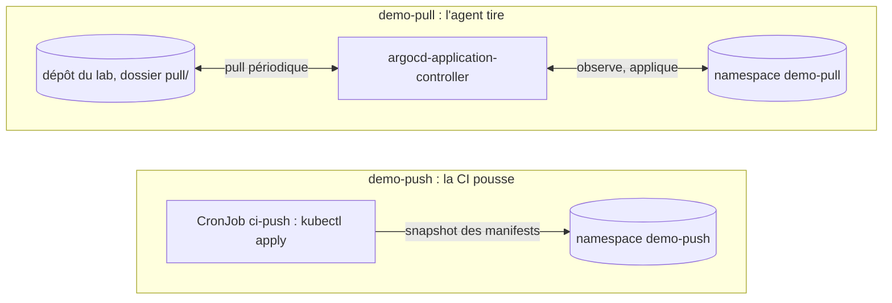
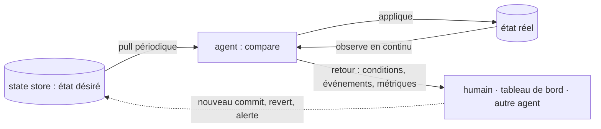

# OpenGitOps — les quatre principes et le vocabulaire, prouvés sur le lab

> Niveau **débutant** · durée **4 h** · profil de lab **linux-base** (kind sur une VM ; variante **kubernetes-ha**) ·
> couvre **CGOA-01-01, 01-06, 01-07, 01-08, 02-01, 02-02** et consolide **CGOA-01-02 à 01-05, 01-09, 02-03, 02-04** (vus en fiche 01).

Statut d'exécution de cette version : la session de rédaction disposait d'un démon Docker mais l'hôte est en cgroup v1 et
son noyau refuse les `oom_score_adj` négatifs, donc `kind` n'a pas pu démarrer de plan de contrôle. Les commandes qui touchent
un cluster sont marquées `[non testé : pas de cluster dans la session de rédaction]`. Ont été exécutés pour de vrai :
tout le côté Git (serveur SSH local, dépôt bare, options `receive.*`, hooks, clé en lecture seule, revert, reflog,
signatures SSH), le script de panne `08-gitops-state-store-rewritten.sh` de bout en bout, la page de l'application
dans un conteneur `nginx`, l'image `alpine/k8s` du CronJob, `kubeconform` sur les neuf manifests, l'aide du CLI `argocd`
à la version `argo_cd`, et la lecture de `argocd-cm.yaml`, `metrics.md` et du CRD `Application` à cette même version.
Le statut passera à `validé en conditions réelles` après une exécution complète sur le lab.

Plan validé : `docs/plans/gitops-08-opengitops-principes-et-vocabulaire.md`. Référentiel : principes et glossaire OpenGitOps
à la version `opengitops_documents` de `versions.yaml`, cités en anglais (l'examen CGOA reprend ces formulations) puis expliqués.

## Objectifs mesurables

À la fin de cette fiche tu sais :

- réciter les quatre principes OpenGitOps en anglais et dire, pour chacun, ce qu'il interdit concrètement, sans notes,
  en moins de 3 min ;
- auditer une chaîne de déploiement décrite en dix lignes : principes violés, terme exact de chaque violation, correction,
  en moins de 10 min ;
- nommer les trois parties d'un « GitOps managed software system » et les désigner sur le lab par leurs objets réels en moins de 5 min ;
- rendre un dépôt bare immuable et le prouver par un `push --force` et une suppression refusés, en moins de 10 min ;
- revenir en arrière par `git revert` et expliquer en deux phrases pourquoi `argocd app rollback` n'est pas la même chose,
  en moins de 5 min ;
- mesurer le délai de prise en compte d'un commit, le réduire par `timeout.reconciliation`, et le distinguer du délai de
  réparation d'une dérive, en moins de 10 min ;
- lire le retour d'information d'un agent (conditions, événements, métriques) et retrouver d'où vient un `OutOfSync` en moins de 5 min ;
- définir les neuf termes de CGOA-01 avec tes mots puis les faire correspondre, un à un, au glossaire OpenGitOps.

## Section 1 — Les quatre principes : push contre pull

Chaque section suit le cycle ci-dessous, dans cet ordre, sans en sauter.

### Concept (court)

OpenGitOps (`PRINCIPLES.md`, version `opengitops_documents`) tient en une phrase et quatre points. *The desired state of a
GitOps managed system must be:*

1. **Declarative** — *expressed declaratively* : on décrit l'état voulu, pas la procédure pour y arriver.
2. **Versioned and Immutable** — *stored in a way that enforces immutability, versioning and retains a complete version history*.
3. **Pulled Automatically** — *software agents automatically pull the desired state declarations from the source*.
4. **Continuously Reconciled** — *software agents continuously observe actual system state and attempt to apply the desired state*.

Un pipeline qui fait `kubectl apply` après un commit respecte souvent le premier principe et jamais les deux derniers :
c'est la **CI** qui pousse quand on la déclenche, personne n'observe le cluster entre deux exécutions. Manipulation dans les
10 lignes : on déploie la même application des deux façons, côte à côte, et on teste chaque principe sur chacune.



### Démo guidée

Sur la VM `linux-base` de la fiche 01 : cluster `kind` `argocd-lab`, Argo CD à la version `argo_cd`, CLI connecté, projet `lab`.
Vérification de l'état hérité :

```bash
argocd app list -o name            # attendu : guestbook, lab-demo
argocd proj get lab | grep -A3 'Source Repositories'
```

`[non testé : pas de cluster dans la session de rédaction]`. Le dépôt du lab est un dépôt bare SSH (fiche 01, DECISIONS.md).
On en crée un second pour cette fiche, sur la même machine, avec la clé de l'apprenant en écriture et une clé dédiée à Argo CD.
`GIT_HOST` et `GIT_PORT` désignent l'hôte Git (sur la VM : son adresse et `22` ; dans la session de rédaction : `127.0.0.1:2222`).

```bash
sudo -u git git init -q --bare --initial-branch=main /srv/git/gitops-principes.git
ssh-keygen -t ed25519 -N '' -f ~/.ssh/argocd_ed25519 -C argocd-lab
cat ~/.ssh/argocd_ed25519.pub | sudo -u git tee -a /srv/git/.ssh/authorized_keys >/dev/null   # restreinte en section 2
cd ~ && git clone "ssh://git@${GIT_HOST}:${GIT_PORT}/srv/git/gitops-principes.git" && cd gitops-principes
cp -r ~/WorkbookDevops/fiches/gitops/08-opengitops-principes-et-vocabulaire/repo/{push,pull} .
git add . && git commit -m 'v1 : push/ et pull/ identiques' && git push origin main
git log --oneline
```

Sortie obtenue (exécuté) :

```text
4950094 v1 : push/ et pull/ identiques
```

Les deux dossiers contiennent la même application : un `Deployment` `nginx:1.29-alpine` (tag vérifié sur Docker Hub le 2026-10-02)
qui sert une page HTML stockée dans une `ConfigMap`, et un `Service`. La page est la « fonctionnalité » qu'on va casser et réparer.
Vérifiée dans un conteneur avec le contenu de `repo/pull/configmap.yaml` (exécuté) :

```bash
yq -r '.data["index.html"]' repo/pull/configmap.yaml > /tmp/index.html
docker run -d --rm --name webtest -v /tmp:/usr/share/nginx/html:ro -p 127.0.0.1:18080:80 nginx:1.29-alpine
curl -s http://127.0.0.1:18080/ ; docker stop webtest
```

```text
<h1>demo-pull</h1>
<p>version: v1</p>
```

**Côté push.** Un `CronJob` dans le namespace `ci-legacy` joue la CI : toutes les deux minutes il fait `kubectl apply` du contenu
d'une `ConfigMap` `push-manifests`, construite depuis le dossier `push/` au moment du « build ». Son ServiceAccount n'a de droits
que dans `demo-push`. Image `alpine/k8s` au tag de la clé `kubernetes` (le binaire `kubectl` de l'image a été exécuté :
`Client Version: v1.37.1`).

```bash
M=~/WorkbookDevops/fiches/gitops/08-opengitops-principes-et-vocabulaire/manifests
kubectl apply -f "$M/ci-push-rbac.yaml"
kubectl -n ci-legacy create configmap push-manifests --from-file=push/
kubectl apply -f "$M/ci-push-cronjob.yaml"
kubectl -n ci-legacy create job --from=cronjob/ci-push ci-push-now      # premier « run du pipeline » sans attendre
kubectl -n ci-legacy wait job/ci-push-now --for=condition=complete --timeout=120s
kubectl -n demo-push get deploy,svc,cm
```

`[non testé : pas de cluster dans la session de rédaction]`. Les manifests ont été validés (exécuté, voir « Points de vigilance ») :

```text
Summary: 13 resources found in 9 files - Valid: 13, Invalid: 0, Errors: 0, Skipped: 0
```

**Côté pull.** Le projet `lab` doit autoriser le nouveau dépôt, Argo CD doit le connaître avec sa clé, puis une `Application`
`automated` + `prune` + `selfHeal` tire le dossier `pull/`.

```bash
argocd proj add-source lab "ssh://git@${GIT_HOST}:${GIT_PORT}/srv/git/gitops-principes.git"
argocd repo add "ssh://git@${GIT_HOST}:${GIT_PORT}/srv/git/gitops-principes.git" \
  --ssh-private-key-path ~/.ssh/argocd_ed25519 --name gitops-principes
sed "s#ssh://git@git.lab.home.arpa/#ssh://git@${GIT_HOST}:${GIT_PORT}/#" "$M/application-demo-pull.yaml" | kubectl apply -f -
argocd app wait demo-pull --sync --health --timeout 180
argocd app get demo-pull | head -20
kubectl -n demo-pull port-forward svc/web 8088:80 >/dev/null 2>&1 &
curl -s http://localhost:8088/        # attendu : la page v1
```

`[non testé : pas de cluster dans la session de rédaction]` ; les drapeaux `proj add-source`, `repo add`, `app wait` viennent
de l'aide du CLI (exécutée). La clé d'hôte SSH doit être connue d'Argo CD (`argocd cert add-ssh --batch`, fiche 01) ;
sur la VM `kind`, c'est déjà fait pour le dépôt `gitops-demo` du même hôte.

**La grille.** Même test des deux côtés, une commande par case, et tu notes ce que tu observes.
`[non testé : pas de cluster dans la session de rédaction]` : les colonnes « attendu » viennent du fonctionnement documenté
d'Argo CD 3.5 et d'un `kubectl apply` périodique ; vérifie-les, c'est l'exercice.

| Principe | Test | `demo-pull` (attendu) | `demo-push` (attendu) |
|---|---|---|---|
| Declarative | `kubectl -n demo-X scale deploy web --replicas=3` | `OutOfSync` en quelques secondes (l'agent observe), remis à 1 par `selfHeal` | remis à 1 au prochain run du CronJob (≤ 2 min) : un `apply` périodique **ressemble** à une réconciliation |
| Versioned and Immutable | `sed -i 's/v1/v2/' X/configmap.yaml && git commit -am v2 && git push` | page v2 après le prochain pull (≤ `timeout.reconciliation` + jitter) | toujours v1 : la CI applique sa `ConfigMap` figée, il faut « relancer le pipeline » (`create configmap … --dry-run=client -o yaml \| kubectl replace -f -`) |
| Pulled Automatically | `git rm X/service.yaml && git commit -m 'sans service' && git push` | le `Service` est supprimé (`prune`) | le `Service` reste : `apply` ne retire jamais ce qui a disparu du dossier |
| Continuously Reconciled | arrêter l'agent (`kubectl -n argocd scale sts argocd-application-controller --replicas=0` / `kubectl -n ci-legacy patch cronjob ci-push -p '{"spec":{"suspend":true}}'`), dériver, relancer | la dérive reste visible puis est réparée au redémarrage ; l'état désiré est **dans Git** | la dérive reste jusqu'au prochain run ; l'état désiré est dans une `ConfigMap` du cluster, ni versionnée, ni immuable |

Remets `v1`, le `Service` et l'agent en place avant la section 2 (`git revert` des deux commits, `kubectl … --replicas=1`, `suspend: false`).

### Exercice autonome

1. Le glossaire définit un *Software System* géré par GitOps en trois parties : *runtime environments consisting of resources
   under management*, *management agents within each runtime*, *policies for controlling access and management of repositories,
   deployments, runtimes*. Désigne chacune sur le lab par des objets concrets (Kubernetes **et** Git), pour `demo-pull`.
2. Fais la même chose pour `demo-push` : quelle partie manque ou est au mauvais endroit ?
3. Écris une phrase par principe qui dit ce que `demo-push` ne garantit **pas**, même après avoir ajouté un `selfHeal` maison
   (le CronJob toutes les minutes au lieu de toutes les deux minutes).

Compétences couvertes : `CGOA-01-02`, `CGOA-01-03`, `CGOA-01-06`, `CGOA-02-01`, `CGOA-02-02`, `CGOA-02-03`, `CGOA-02-04`.

### Break-fix

Script : `break/gitops/08-gitops-push-direct.sh` — injecte la panne, `--undo` la retire, `--reveal` l'explique.

Symptôme : `demo-pull` alterne `OutOfSync` / `Synced` environ toutes les minutes ; `argocd app diff demo-pull` montre toujours
le même écart ; couper puis remettre `selfHeal` ne change rien. Git n'a pas bougé.

### Défi chronométré

Trois textes de dix lignes décrivant chacun une chaîne de déploiement sont dans `solutions/` (sans leur corrigé, en tête de fichier).
Pour un texte tiré au sort : lister les principes violés, le **terme** du glossaire qui nomme chaque violation, et la correction.
**10 min.** Critère : au moins trois violations sur quatre trouvées, vérifiées avec le corrigé.

## Section 2 — Le magasin d'état : versionné, immuable, contrôlé

### Concept (court)

Le glossaire ne dit pas « Git », il dit **State Store** : *a system for storing immutable versions of desired state declarations.
This state store should provide access control and auditing on the changes to the Desired State.* Quatre critères :
immuable, versionné, contrôle d'accès, audit. Git est l'exemple canonique, **mais un dépôt Git n'est pas immuable par défaut** :
un `push --force` réécrit l'historique et personne n'est prévenu. Le principe 2 demande de **configurer** le store.
Conséquence directe pour le terme **Rollback** : revenir en arrière, c'est publier un nouvel état désiré (un commit de `revert`),
pas effacer l'ancien. Manipulation : on casse puis on verrouille le dépôt du lab.

### Démo guidée

Toutes les commandes de cette section ont été exécutées ; côté serveur, on agit en tant qu'utilisateur `git` sur la machine qui
héberge le dépôt bare (`BARE=/srv/git/gitops-principes.git`). État par défaut, sur une branche de test :

```bash
sudo -u git git -C "$BARE" config --get receive.denyNonFastForwards || echo '(non défini : la réécriture est acceptée par défaut)'
git switch -c test-immutable
git commit --allow-empty -m 'à effacer' && git push -u origin test-immutable
git reset --hard HEAD~1 && git push --force origin test-immutable
```

```text
(non défini : la réécriture est acceptée par défaut)
To ssh://127.0.0.1:2222/srv/git/gitops-principes.git
 + a80b14e...4950094 test-immutable -> test-immutable (forced update)
```

Le commit `a80b14e` n'existe plus pour personne. Verrouillage, en trois options côté serveur, puis le même test :

```bash
sudo -u git git -C "$BARE" config receive.denyNonFastForwards true
sudo -u git git -C "$BARE" config receive.denyDeletes true
sudo -u git git -C "$BARE" config core.logAllRefUpdates true      # un dépôt bare n'a pas de reflog par défaut
git commit --allow-empty -m 'à effacer' && git push origin test-immutable
git reset --hard HEAD~1 && git push --force origin test-immutable
git push origin --delete test-immutable
```

```text
remote: error: denying non-fast-forward refs/heads/test-immutable (you should pull first)
To ssh://127.0.0.1:2222/srv/git/gitops-principes.git
 ! [remote rejected] test-immutable -> test-immutable (non-fast-forward)
error: failed to push some refs to 'ssh://127.0.0.1:2222/srv/git/gitops-principes.git'
remote: error: denying ref deletion for refs/heads/test-immutable
To ssh://127.0.0.1:2222/srv/git/gitops-principes.git
 ! [remote rejected] test-immutable (deletion prohibited)
error: failed to push some refs to 'ssh://127.0.0.1:2222/srv/git/gitops-principes.git'
```

Seul un administrateur **sur le serveur** peut encore supprimer la branche : c'est le contrôle d'accès qui décide, pas le client.

```bash
sudo -u git git -C "$BARE" branch -D test-immutable
git switch main && git branch -D test-immutable
```

```text
Deleted branch test-immutable (was a80b14e).
```

Contrôle d'accès : la clé d'Argo CD n'a besoin que de lire. Dans `authorized_keys` de l'utilisateur `git`, on la force sur
`git-upload-pack` (le service de lecture) d'un seul dépôt ; `git-shell` exige le chemin entre apostrophes.

```bash
sudo -u git cat /srv/git/.ssh/authorized_keys | cut -c1-110
GIT_SSH_COMMAND='ssh -i ~/.ssh/argocd_ed25519' git ls-remote "ssh://git@${GIT_HOST}:${GIT_PORT}/srv/git/gitops-principes.git" main
```

```text
ssh-ed25519 AAAAC3NzaC1lZDI1NTE5AAAAIBrFniHTDl4wmFhxQi2ANe6MgCHk1PYRvK11KzdcVcmT apprenant
command="git-upload-pack '/srv/git/gitops-principes.git'",no-port-forwarding,no-pty,no-agent-forwarding,no-X11
49500943d7b64c917a18f09bdeb8371e9e1a9760    refs/heads/main
```

La lecture passe. Un push avec cette clé, depuis un clone fait avec elle, échoue : le serveur ne lance que `upload-pack`
alors que le client attend `receive-pack`. Le message est confus (il parle même de `main -> main`), mais la dernière ligne
et un `git ls-remote` ensuite montrent que `main` n'a pas bougé.

```text
fatal: git upload-pack: protocol error, expected to get object ID, not '8d33059… 36cf440… refs/heads/main'
send-pack: unexpected disconnect while reading sideband packet
error: failed to push some refs to 'ssh://127.0.0.1:2222/srv/git/gitops-principes.git'
```

Rollback « à la GitOps » : on publie une page v2, puis on revient en arrière par un **nouveau commit**.

```bash
sed -i 's/version: v1/version: v2/' pull/configmap.yaml
git commit -am 'v2 : nouvelle page' && git push origin main && git log --oneline -2
git revert --no-edit HEAD && git push origin main && git log --oneline -3
grep version pull/configmap.yaml
```

```text
5833e33 v2 : nouvelle page
4950094 v1 : push/ et pull/ identiques
[main 2bc83dd] Revert "v2 : nouvelle page"
 1 file changed, 1 insertion(+), 1 deletion(-)
2bc83dd Revert "v2 : nouvelle page"
5833e33 v2 : nouvelle page
4950094 v1 : push/ et pull/ identiques
    <p>version: v1</p>
```

Trois commits, historique complet, et `demo-pull` suit : v2 puis v1 au rythme de ses pulls
`[non testé : pas de cluster dans la session de rédaction]`. Audit, côté serveur : qui a changé quoi, quand.

```bash
sudo -u git git -C "$BARE" reflog show main
sudo -u git git -C "$BARE" log --format='%h %ci %an <%ae> %s' -3
```

```text
2bc83dd main@{0}: push
5833e33 main@{1}: push
2bc83dd 2026-10-02 22:27:28 +0000 apprenant <apprenant@lab.home.arpa> Revert "v2 : nouvelle page"
5833e33 2026-10-02 22:27:28 +0000 apprenant <apprenant@lab.home.arpa> v2 : nouvelle page
4950094 2026-10-02 22:27:26 +0000 apprenant <apprenant@lab.home.arpa> v1 : push/ et pull/ identiques
```

Le reflog ne commence qu'à l'activation de `core.logAllRefUpdates` : le commit `v1` n'y est pas. Et l'autre rollback ?
`argocd app rollback demo-pull` rejoue une révision déjà déployée **sans toucher à Git** ; il est refusé tant que `automated`
est actif (vérifié en fiche 01), et une fois fait, l'Application est `OutOfSync` par construction : l'état vivant ne correspond
plus à ce que le store déclare. C'est un outil d'urgence, pas un état désiré.

### Exercice autonome

1. Mets le dépôt `gitops-principes.git` en conformité avec les quatre critères du glossaire et prouve-le : un tableau
   « critère → mécanisme → commande de preuve rejouable » (immuable, versionné, contrôle d'accès, audit).
2. Explique en deux phrases pourquoi `git revert` est un rollback au sens OpenGitOps et pourquoi `argocd app rollback` n'en est pas un.
3. Option : signe tes commits avec ta clé SSH (`gpg.format ssh`, `user.signingkey`, `commit.gpgsign`), publie la liste des
   signataires autorisés sur le serveur (`allowed_signers`) et refuse les commits non signés par un hook `pre-receive`.
   Prouve-le par un push refusé.

Compétences couvertes : `CGOA-01-07`, `CGOA-01-09`, `CGOA-02-02`.

### Break-fix

Script : `break/gitops/08-gitops-state-store-rewritten.sh` — à lancer **sur le serveur Git** en tant que `git`
(`sudo BARE_REPO=/srv/git/gitops-principes.git -u git ./08-gitops-state-store-rewritten.sh`) ; `--undo` répare, `--reveal` explique.

Symptôme : une fonctionnalité disparaît du cluster sans aucun commit dans `git log` ; `argocd app history demo-pull` cite une
révision que `git show` ne trouve plus dans un clone frais ; `argocd app rollback` vers cette révision échoue.

### Défi chronométré

Un dépôt bare vierge est fourni (`sudo -u git git init --bare --initial-branch=main /srv/git/defi-08.git`). Le rendre immuable,
y pousser le dossier `pull/`, publier une v2 puis revenir à v1 par `revert`. **10 min.** Critère :
`sudo -u git git -C /srv/git/defi-08.git config --get receive.denyNonFastForwards` vaut `true`, `git log --oneline` montre trois
commits dont un `Revert`, et `git push --force` d'un historique réécrit est refusé.

## Section 3 — La boucle de contrôle : continu, dérive, retour d'information

### Concept (court)

Quatre termes du glossaire, dans l'ordre où la boucle les rencontre :

- **Drift** : *when a system's actual state has moved or is in the process of moving away from the desired state* ;
- **Reconciliation** : *the process of ensuring the actual state of a system matches its desired state* ; déclenchée *whenever
  there is a divergence*, qu'elle vienne d'une dérive ou d'un nouvel état désiré ;
- **Continuous** : *reconciliation continues to happen, not that it must be instantaneous* ;
- **Feedback** : OpenGitOps *operates in a closed-loop* ; *feedback represents how previous attempts to apply a desired state have
  affected the actual state* ; sur ce retour, l'agent réessaie, revient en arrière ou alerte un humain.



Argo CD a **deux** rythmes : il **observe** le cluster en continu (un `kubectl scale` est vu en secondes) et il **tire** Git
périodiquement, toutes les `timeout.reconciliation` (120 s par défaut à la version `argo_cd`, plus un jitter de 60 s).
« Continu » n'est donc pas « instantané » : un commit attend jusqu'à trois minutes. Manipulation : on mesure les deux délais.

### Démo guidée

Toute cette démo est `[non testé : pas de cluster dans la session de rédaction]` ; les clés de configuration, les champs de
statut et les noms de métriques ont été lus dans les sources d'Argo CD à la version `argo_cd` (voir « Points de vigilance »).
Délai 1, la dérive, avec `selfHeal` :

```bash
date -u +%T ; kubectl -n demo-pull scale deploy web --replicas=3
for i in $(seq 1 12); do
  sleep 5; printf '%s ' "$(date -u +%T)"
  argocd app get demo-pull -o json | jq -r '.status.sync.status + " replicas=" + (.status.resources[] | select(.kind=="Deployment") | .health.status)'
done
kubectl -n demo-pull get deploy web -o jsonpath='{.spec.replicas}{"\n"}'     # attendu : 1 en moins d'une minute
```

Délai 2, le commit, à 120 s puis à 30 s :

```bash
sed -i 's/version: v1/version: v2/' pull/configmap.yaml && git commit -qam 'v2' && date -u +%T && git push -q origin main
until argocd app get demo-pull -o json | jq -e '.status.sync.revision == "'"$(git rev-parse HEAD)"'"' >/dev/null; do sleep 5; done
date -u +%T ; argocd app get demo-pull -o json | jq -r '.status.reconciledAt'
kubectl -n argocd patch cm argocd-cm --type merge -p '{"data":{"timeout.reconciliation":"30s","timeout.reconciliation.jitter":"0s"}}'
kubectl -n argocd rollout restart statefulset/argocd-application-controller
kubectl -n argocd rollout status statefulset/argocd-application-controller --timeout=120s
git revert --no-edit HEAD && date -u +%T && git push -q origin main      # même mesure : attendu ≤ 30 s
```

Le changement de `timeout.reconciliation` exige le redémarrage du contrôleur (commentaire d'`argocd-cm.yaml` à la version `argo_cd`).
Sans `selfHeal`, la dérive est **détectée** (OutOfSync) mais pas **réparée** : c'est la différence entre observer et réconcilier.

```bash
argocd app set demo-pull --self-heal=false
kubectl -n demo-pull scale deploy web --replicas=3 ; sleep 30
argocd app get demo-pull | grep -E 'Sync Status|Health Status'   # attendu : OutOfSync, Healthy, et ça ne bouge plus
argocd app set demo-pull --self-heal
```

Le retour d'information, sans Prometheus (fiche 12) : trois sources, du plus humain au plus machine.

```bash
argocd app get demo-pull -o json | jq '.status.conditions, .status.operationState.phase, .status.operationState.finishedAt'
kubectl -n argocd get events --sort-by=.lastTimestamp | tail -5
kubectl -n argocd port-forward svc/argocd-metrics 8082:8082 >/dev/null 2>&1 &
curl -s http://localhost:8082/metrics | grep -E '^argocd_app_info\{.*name="demo-pull"|^argocd_app_sync_total\{.*name="demo-pull"'
```

`argocd_app_info` porte les labels `sync_status` et `health_status` ; `argocd_app_sync_total` compte les syncs par phase.
Un humain lit `app get`, un tableau de bord lit les métriques, un autre agent (Argo Rollouts, fiche 05) lit le même retour
pour décider d'un rollback automatique : c'est le même **feedback**, consommé trois fois.

### Exercice autonome

1. Écris les neuf termes de CGOA-01 (Continuous, Declarative Description, Desired State, State Drift, State Reconciliation,
   GitOps Managed Software System, State Store, Feedback Loop, Rollback) avec tes mots, une phrase chacun, **avant** de relire le glossaire.
2. Confronte chaque phrase à la définition OpenGitOps et note l'écart de sens, s'il y en a un. Deux pièges classiques :
   « continu » et « instantané » ; « desired state » et les données persistantes.
3. Mesure, sur le lab, le délai réel entre un `git push` et le changement de `status.sync.revision` avec le jitter par défaut,
   trois fois de suite ; explique l'écart entre les trois mesures avec le mot du glossaire qui convient.

Compétences couvertes : `CGOA-01-01`, `CGOA-01-04`, `CGOA-01-05`, `CGOA-01-08`, `CGOA-02-04`.

### Break-fix

Script : `break/gitops/08-gitops-reconciliation-stalled.sh` — injecte la panne, `--undo` la retire, `--reveal` l'explique.

Symptôme : un commit poussé n'est jamais déployé ; `argocd app get demo-pull --hard-refresh` le voit et le déploie une fois,
puis plus rien jusqu'au prochain refresh manuel. Une dérive du cluster, elle, est toujours réparée.

### Défi chronométré

Panne injectée à l'aveugle parmi les trois scripts de la fiche. Diagnostic, correction, puis une phrase qui nomme le principe
ou le terme OpenGitOps violé. **10 min.** Critère :
`argocd app list -o json | jq -r '.[] | .metadata.name + " " + .status.sync.status + " " + .status.health.status'`
ne renvoie que des lignes `Synced Healthy`, et la phrase est validée par `--reveal`.

## Checklist de maîtrise

À cocher honnêtement, en conditions réelles (terminal seul, documentation officielle, minuteur).

- [ ] Je sais réciter les quatre principes en anglais et dire ce que chacun interdit, en moins de 3 min sans notes
- [ ] Je sais auditer une chaîne de déploiement décrite en dix lignes en moins de 10 min, avec le terme exact de chaque violation
- [ ] Je sais désigner sur le lab les trois parties d'un système géré par GitOps en moins de 5 min
- [ ] Je sais verrouiller un dépôt bare et prouver son immutabilité par un `push --force` refusé en moins de 10 min
- [ ] Je sais faire un rollback par `git revert` et expliquer la différence avec `argocd app rollback` en moins de 5 min
- [ ] Je sais mesurer le délai de prise en compte d'un commit, le régler, et le distinguer de la réparation d'une dérive
- [ ] Je sais lire conditions, événements et `argocd_app_info` et dire d'où vient un `OutOfSync` en moins de 5 min
- [ ] Je sais définir les neuf termes de CGOA-01 sans écart avec le glossaire, en 3 phrases chacun au plus, sans notes

## Points de vigilance (versions)

- `opengitops_documents` 1.0.0 : les citations viennent du tag `v1.0.0` de `open-gitops/documents` (lu le 2026-10-02), jamais
  de la branche `main`, annoncée « work in progress ». Si une nouvelle version sort, comparer les définitions avant de
  changer la clé : les flashcards citent le texte.
- `argo_cd` 3.5.3 : `timeout.reconciliation` vaut **120 s** par défaut (`defaultAppResyncPeriod = 120` dans
  `util/settings/settings.go` à cette version, lu le 2026-10-02) avec un jitter de 60 s ; une partie de la documentation et
  beaucoup de supports d'examen disent encore « 3 minutes ». Le plan de cette fiche le disait aussi : corrigé ici. Le
  changement exige un redémarrage de `argocd-application-controller` et de `argocd-repo-server`.
- Métriques : service `argocd-metrics`, port 8082 ; `argocd_app_info` (labels `sync_status`, `health_status`), `argocd_app_sync_total`,
  `argocd_app_reconcile` (`docs/operator-manual/metrics.md` à la version `argo_cd`). Les champs `status.reconciledAt` et
  `status.operationState.finishedAt` existent dans le CRD `Application` de cette version.
- `argocd app rollback` reste refusé avec `automated` actif (fiche 01) ; `argocd app set --self-heal=false` est la forme
  pour désactiver (drapeau booléen, aide du CLI exécutée).
- `kind` 0.33.0 et clé `kubernetes` 1.37 : même écart accepté que les fiches 01 et 02. Le CronJob utilise l'image `alpine/k8s`
  au tag `1.37.1` (communautaire, vérifié sur Docker Hub le 2026-10-02) ; `bitnami/kubectl` n'est plus publié par version.
- Git 2.43 (Ubuntu 24.04) : `receive.denyNonFastForwards`, `receive.denyDeletes`, `core.logAllRefUpdates`, `gpg.format ssh`
  et `gpg.ssh.allowedSignersFile` existent. Dans la session de rédaction, `gpg.ssh.program` pointait sur un outil de l'environnement :
  il a été forcé sur `/usr/bin/ssh-keygen` dans le clone de test ; sur la VM, rien à régler.
- Supprimer la branche courante d'un dépôt bare est refusé même sans `receive.denyDeletes` (`receive.denyDeleteCurrent`) :
  la démo utilise une branche de test pour montrer l'effet de l'option.
- Schémas pour `kubeconform` : catalogue `datreeio/CRDs-catalog` pour `Application`, schémas Kubernetes par défaut pour le reste ;
  le dossier `repo/` n'est pas vérifié par la CI (seuls `manifests/` et `k8s/` le sont), il l'a été à la main.

## Liens

- Solutions (3 indices puis correction commentée) : `solutions/fiches/gitops/08-opengitops-principes-et-vocabulaire.md`
- Pannes scriptées : `break/gitops/`
- Flashcards (10 à 20, CSV `question;réponse;tags`) : `revision/flashcards/gitops-08-opengitops-principes-et-vocabulaire.csv`
- Mapping certification : `certifs/CGOA/objectifs.md`
- Référentiel : `PRINCIPLES.md` et `GLOSSARY.md` de `open-gitops/documents` à la version `opengitops_documents`
- Rappel espacé : séances J+1, J+7, J+30 à noter dans `journal/`
