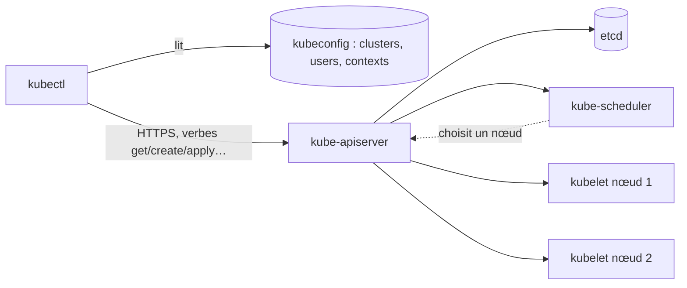
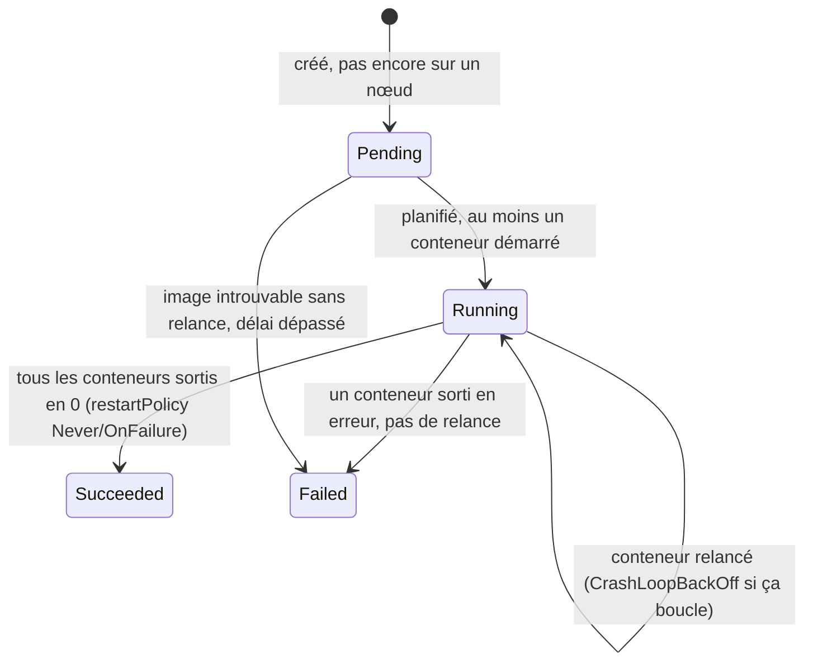

# kubectl, Pods et namespaces — le poste de travail de l'examen

> Niveau **débutant** · durée **5 h** · profil de lab **linux-base** (kind sur une VM) · couvre **CKAD-01-02, CKAD-03-03, CKAD-03-04**
> (et CKA-02-04, CKA-04-04, KCNA-01-01 à confirmer par leurs cartographies).

Première fiche du domaine `kubernetes`. Tout ce que tu fais à l'examen CKAD passe par `kubectl` dans un terminal, avec un seul onglet
de documentation ([`certifs/CKAD/examen.md`](../../certifs/CKAD/examen.md) : 15 à 20 tâches en 120 min). Cette fiche installe le poste,
puis apprend les gestes de base sur l'objet le plus petit, le Pod. Les workloads (fiche 03), les volumes (05), la configuration (06)
et la méthode complète de diagnostic (09) viennent ensuite.

**Ce qui a été exécuté.** La session de rédaction ne peut pas lancer `kind` (le bac à sable interdit à `runc` d'écrire
`oom_score_adj`, aucun kubelet ne démarre). Les commandes marquées **(exécuté)** ont tourné le 2026-10-02 contre un control plane
Kubernetes 1.37.1 **sans nœud** (etcd 3.7.2 + `kube-apiserver` + `kube-controller-manager` + `kube-scheduler`, binaires officiels de
`dl.k8s.io`) : tout ce qui est côté API (création, lecture, labels, contextes, événements) est réel ; tout ce qui exige un nœud (Pod
`Running`, logs, `exec`, `port-forward`, `CrashLoopBackOff`) est marqué `[non testé]` avec la raison. Les quatre scripts de panne ont
été exécutés (injection, `--reveal`, `--undo`) sur ce même control plane. Le statut passera à `validé en conditions réelles` après
une exécution complète sur la VM du lab.

Plan validé : [`docs/plans/kubernetes-01-kubectl-pods-namespaces.md`](../../docs/plans/kubernetes-01-kubectl-pods-namespaces.md).
Arbitrages : `DECISIONS.md` (2026-10-02 : numérotation, `kind` en chemin principal, VM `lx01` à 4 vCPU / 8 Go).

## Objectifs mesurables

À la fin de cette fiche tu sais :

- créer un cluster `kind` à la version de `versions.yaml` avec un `kubectl` configuré, complété et aliasé, en moins de 15 min ;
- produire le manifest d'un Pod avec `kubectl run --dry-run=client -o yaml`, l'adapter dans `vim` et l'appliquer, en moins de 3 min,
  sans ouvrir la documentation ;
- changer de contexte et de namespace par défaut et le vérifier, en moins de 30 s ;
- extraire une valeur précise d'un objet avec `-o jsonpath` ou `-o custom-columns` et la mettre dans un fichier, en moins de 2 min ;
- lire les logs du conteneur précédent d'un Pod redémarré, exécuter une commande dedans et copier un fichier, en moins de 2 min ;
- diagnostiquer un `kubectl` qui ne répond plus, un Pod `CrashLoopBackOff` et un Pod `Pending` en moins de 5 min chacun, avec
  `describe`, `events` et `logs` seulement ;
- expliquer sans notes, en trois phrases, la différence `create` / `apply` / `replace` et ce qu'est un contexte kubeconfig.

## Section 1 — Le poste de travail : cluster, kubectl, contextes

Chaque section suit le cycle ci-dessous, dans cet ordre, sans en sauter.

### Concept (court)

`kubectl` ne parle qu'à une seule chose : l'**API server**. Il sait où il est et comment s'authentifier grâce au **kubeconfig**
(`~/.kube/config` par défaut), qui contient des *clusters* (une URL, une CA), des *users* (un certificat ou un token) et des
*contexts* (un cluster + un user + un namespace par défaut). Changer de cluster à l'examen, c'est changer de contexte.



Sur la VM, `kind` crée des nœuds Kubernetes dans des conteneurs Docker : un control plane, deux workers. Manipulation.

### Démo guidée

Sur la VM `linux-base-lx01` (Ubuntu 24.04, Docker installé par le paquet `docker.io` ou le dépôt Docker, ton utilisateur dans le
groupe `docker`). On lit les versions dans `versions.yaml`, jamais en dur.

```bash
cd ~/WorkbookDevops
KUBERNETES_VERSION=$(yq -r '.components.kubernetes.version' versions.yaml)
KIND_VERSION=$(yq -r '.components.kind.version' versions.yaml)
CILIUM_VERSION=$(yq -r '.components.cilium.version' versions.yaml)
echo "kubernetes=$KUBERNETES_VERSION kind=$KIND_VERSION cilium=$CILIUM_VERSION"
```

Sortie obtenue (exécuté) :

```text
kubernetes=1.37.1 kind=0.33.0 cilium=1.20.2
```

Les deux binaires, à la version exacte.

```bash
sudo curl -sSL -o /usr/local/bin/kubectl "https://dl.k8s.io/release/v${KUBERNETES_VERSION}/bin/linux/amd64/kubectl"
sudo curl -sSL -o /usr/local/bin/kind "https://github.com/kubernetes-sigs/kind/releases/download/v${KIND_VERSION}/kind-linux-amd64"
sudo chmod +x /usr/local/bin/kubectl /usr/local/bin/kind
kubectl version --client
kind version
```

Sortie obtenue (exécuté) :

```text
Client Version: v1.37.1
Kustomize Version: v5.8.1
kind v0.33.0 go1.26.7 linux/amd64
```

Le cluster, depuis le fichier de configuration du chapitre : trois nœuds, CNI par défaut désactivé (Cilium prend la place, il
servira aux NetworkPolicies de la fiche 13), un port publié pour la fiche 12.

```bash
cat fiches/kubernetes/01-kubectl-pods-namespaces/manifests/kind-config.yaml
kind create cluster --name ckad-lab --config fiches/kubernetes/01-kubectl-pods-namespaces/manifests/kind-config.yaml
kubectl get nodes
```

`[non testé : pas de cluster dans la session de rédaction]`. Attendu : trois nœuds `ckad-lab-control-plane`, `ckad-lab-worker`,
`ckad-lab-worker2` en `NotReady` tant que Cilium n'est pas là. L'image de nœud par défaut de `kind` 0.33.0 est
`kindest/node:v1.37.0` (notes de version de `kind`, lues le 2026-10-02) : même mineure que `versions.yaml` et que l'examen.

Cilium en quatre commandes, sans explication ici (c'est le réseau du cluster, la fiche 13 et CCA y reviennent). Le CLI `cilium`
a sa propre clé dans `versions.yaml` (`cilium_cli`, ajoutée par la cartographie CCA), distincte de l'agent.

```bash
CILIUM_CLI_VERSION=v$(yq -r '.components.cilium_cli.version' versions.yaml)
curl -sSL "https://github.com/cilium/cilium-cli/releases/download/${CILIUM_CLI_VERSION}/cilium-linux-amd64.tar.gz" \
  | sudo tar -xzf - -C /usr/local/bin cilium
cilium version --client
cilium install --version "$CILIUM_VERSION" --set ipam.mode=kubernetes
cilium status --wait
kubectl get nodes -o wide
```

Sortie obtenue pour les deux premières commandes (exécuté) :

```text
cilium-cli: v0.20.1 compiled with go1.27.1 on linux/amd64
cilium image (default): v1.20.1
cilium image (stable): v1.20.2
```

`cilium install` et la suite : `[non testé : pas de cluster dans la session de rédaction]`. Attendu : `cilium status` tout vert,
trois nœuds `Ready`. `ipam.mode=kubernetes` est le réglage que la documentation Cilium 1.20 donne pour `kind`.

Maintenant le kubeconfig. `kind` l'a écrit dans `~/.kube/config` et a activé son contexte.

```bash
kubectl config view --minify
kubectl config get-contexts
kubectl config current-context
```

Sortie obtenue (exécuté sur le control plane de session ; sur `kind` le cluster s'appelle `kind-ckad-lab`, le user `kind-ckad-lab`,
et tu verras `certificate-authority-data` / `client-certificate-data` à la place de `insecure-skip-tls-verify` et du token) :

```text
apiVersion: v1
clusters:
- cluster:
    insecure-skip-tls-verify: true
    server: https://127.0.0.1:6443
  name: ckad-lab
contexts:
- context:
    cluster: ckad-lab
    user: ckad-lab-admin
  name: ckad-lab
current-context: ckad-lab
kind: Config
users:
- name: ckad-lab-admin
  user:
    token: REDACTED
CURRENT   NAME       CLUSTER    AUTHINFO         NAMESPACE
*         ckad-lab   ckad-lab   ckad-lab-admin
ckad-lab
```

Trois lignes à savoir taper de mémoire en 60 s, celles que tu retaperas à l'examen si le poste ne les a pas :

```bash
cat >> ~/.bashrc <<'EOF'
source <(kubectl completion bash)
alias k=kubectl
complete -o default -F __start_kubectl k
export KUBE_EDITOR=vim
EOF
printf 'set ts=2 sw=2 et\nsyntax on\n' >> ~/.vimrc
source ~/.bashrc
k get ns
```

(exécuté : la fonction `__start_kubectl` existe après `source <(kubectl completion bash)`, `k get ns` liste `default`,
`kube-node-lease`, `kube-public`, `kube-system`.)

La documentation hors ligne, celle qui ne compte pas comme un onglet : `explain` et `--help`.

```bash
kubectl explain pod.spec.restartPolicy
kubectl explain pod.spec.containers --recursive | head -25
kubectl api-resources --namespaced=true | head -12
kubectl run --help | head -20
```

Sortie obtenue (exécuté, extraits) :

```text
KIND:       Pod
VERSION:    v1

FIELD: restartPolicy <string>
ENUM:
    Always
    Never
    OnFailure
…
FIELDS:
  args  <[]string>
  command  <[]string>
  env  <[]EnvVar>
    name  <string> -required-
    value  <string>
…
NAME                        SHORTNAMES   APIVERSION   NAMESPACED   KIND
configmaps                  cm           v1           true         ConfigMap
pods                        po           v1           true         Pod
```

`explain` connaît tous les champs, avec leur type et s'ils sont obligatoires ; `--recursive` donne l'arbre complet. Qui es-tu
pour l'API ? `kubectl auth whoami` (exécuté : `Username admin`, `Groups [system:masters system:authenticated]` sur le control plane
de session ; sur `kind` attends-toi à `kubernetes-admin` et `kubeadm:cluster-admins`, `[non testé]`).

### Exercice autonome

1. Crée un second cluster `ckad-lab2` d'un seul nœud (sans fichier de configuration, CNI par défaut), puis fusionne son kubeconfig
   avec le premier dans `~/.kube/config` sans perdre `ckad-lab`. Renomme les contextes en `ckad-lab` et `ckad-lab2`. Bascule de l'un
   à l'autre et prouve, par une commande, sur quel cluster tu es.
2. Supprime `ckad-lab2` et nettoie le kubeconfig : plus de contexte, de cluster ni de user orphelin.
3. Sans documentation, retrouve avec `kubectl explain` : le champ qui fixe le nombre de secondes avant qu'un Pod ne soit tué à la
   suppression, et le type du champ `metadata.labels`.

Compétences couvertes : `CKAD-03-03`, `KCNA-01-01`.

### Break-fix

Script : `break/kubernetes/01-kubeconfig-casse.sh` — injecte la panne, `--undo` la retire, `--reveal` l'explique
(`NN` = numéro de la fiche, DECISIONS.md 2026-10-02).

Symptôme : toute commande `kubectl` répond `The connection to the server 127.0.0.1:6444 was refused - did you specify the right
host or port?`. Docker tourne, les trois conteneurs de nœuds sont `Up`.

### Défi chronométré

VM avec Docker, sans `kind` ni `kubectl` : cluster `ckad-lab` à trois nœuds avec Cilium, `kubectl` à la version de `versions.yaml`,
alias `k` complété, contexte renommé `ckad-lab`. **15 min.** Critère : `k get nodes` affiche trois nœuds `Ready` et
`k config current-context` répond `ckad-lab`.

## Section 2 — Pods et namespaces : impératif, déclaratif, formats de sortie

### Concept (court)

Le **Pod** est le plus petit objet planifiable : un ou plusieurs conteneurs qui partagent réseau et volumes. Deux façons de le
créer : l'**impératif** (`kubectl run`, une commande, rapide à l'examen) et le **déclaratif** (un fichier YAML, `kubectl apply`,
rejouable). Le réflexe à automatiser : impératif avec `--dry-run=client -o yaml` pour obtenir le YAML, `vim`, puis `apply`.
Un **namespace** isole les noms ; sans `-n`, `kubectl` utilise celui du contexte. Les **labels** sont des étiquettes que l'on
sélectionne (`-l`) ; les **annotations** sont des métadonnées libres que rien ne sélectionne.

### Démo guidée

Un namespace et le YAML d'un Pod, sans rien écrire à la main.

```bash
kubectl create namespace shop
kubectl run api --image=nginx:1.29 --port=80 --labels=app=api,tier=backend --env=MODE=dev --restart=Never \
  -n shop --dry-run=client -o yaml | tee api.yaml
```

Sortie obtenue (exécuté) :

```text
namespace/shop created
apiVersion: v1
kind: Pod
metadata:
  labels:
    app: api
    tier: backend
  name: api
  namespace: shop
spec:
  containers:
  - env:
    - name: MODE
      value: dev
    image: nginx:1.29
    name: api
    ports:
    - containerPort: 80
    resources: {}
  dnsPolicy: ClusterFirst
  restartPolicy: Never
status: {}
```

Rien n'a été créé (`--dry-run=client` ne parle au serveur que pour la découverte d'API). `create` refuse ce qui existe, `apply`
est idempotent :

```bash
kubectl apply -f api.yaml
kubectl apply -f api.yaml
kubectl create -f api.yaml
```

Sortie obtenue (exécuté) :

```text
pod/api created
pod/api unchanged
Error from server (AlreadyExists): error when creating "api.yaml": pods "api" already exists
```

Le namespace par défaut du contexte, pour arrêter de taper `-n shop` :

```bash
kubectl config set-context --current --namespace=shop
kubectl config get-contexts
kubectl get pods
```

Sortie obtenue (exécuté ; `Pending` parce que le control plane de session n'a pas de nœud, sur `kind` tu verras `Running` `[non testé]`) :

```text
Context "ckad-lab" modified.
CURRENT   NAME       CLUSTER    AUTHINFO         NAMESPACE
*         ckad-lab   ckad-lab   ckad-lab-admin   shop
NAME   READY   STATUS    RESTARTS   AGE
api    0/1     Pending   0          1s
```

Deux Pods de plus en impératif (`--` sépare les options de `kubectl` de la commande du conteneur), puis labels et sélecteurs.

```bash
kubectl run worker --image=busybox:1.37 --restart=Never --labels=app=worker,tier=backend -- sh -c 'while true; do date; sleep 5; done'
kubectl run cache --image=redis:8 --restart=Never --labels=app=cache,tier=data
kubectl get pods --show-labels
kubectl get pods -l tier=backend
kubectl get pods -l 'tier in (backend,data),app!=api' -L app
kubectl label pod cache env=dev
kubectl label pod cache env=prod --overwrite
kubectl annotate pod cache owner=mathieu
kubectl get pod cache -o jsonpath='{.metadata.labels}{"\n"}'
```

Sortie obtenue (exécuté) :

```text
pod/worker created
pod/cache created
NAME     READY   STATUS    RESTARTS   AGE   LABELS
api      0/1     Pending   0          1s    app=api,tier=backend
cache    0/1     Pending   0          0s    app=cache,tier=data
worker   0/1     Pending   0          0s    app=worker,tier=backend
NAME     READY   STATUS    RESTARTS   AGE
api      0/1     Pending   0          1s
worker   0/1     Pending   0          0s
NAME     READY   STATUS    RESTARTS   AGE   APP
cache    0/1     Pending   0          0s    cache
worker   0/1     Pending   0          0s    worker
pod/cache labeled
pod/cache labeled
pod/cache annotated
{"app":"cache","env":"prod","tier":"data"}
```

Les formats de sortie : c'est ce qu'une tâche d'examen demande quand elle dit « écris la liste dans `/opt/…` ».

```bash
kubectl get pods -o jsonpath='{range .items[*]}{.metadata.name}{"\t"}{.spec.containers[0].image}{"\t"}{.spec.nodeName}{"\n"}{end}'
kubectl get pods -o custom-columns='NAME:.metadata.name,NS:.metadata.namespace,IMAGE:.spec.containers[*].image'
kubectl get pods -o name
kubectl get pods --sort-by=.metadata.creationTimestamp -o name
kubectl get pods -A --field-selector status.phase=Pending
```

Sortie obtenue (exécuté ; colonne nœud vide faute de nœud) :

```text
api    nginx:1.29
cache    redis:8
worker    busybox:1.37
NAME     NS     IMAGE
api      shop   nginx:1.29
cache    shop   redis:8
worker   shop   busybox:1.37
pod/api
pod/cache
pod/worker
pod/api
pod/cache
pod/worker
NAMESPACE   NAME     READY   STATUS    RESTARTS   AGE
shop        api      0/1     Pending   0          2s
shop        cache    0/1     Pending   0          1s
shop        worker   0/1     Pending   0          1s
```

Modifier : un label change à chaud, une variable d'environnement non. `diff` montre avant d'appliquer ; `replace --force`
supprime et recrée ; `patch` et `edit` touchent l'objet vivant.

```bash
sed -i 's/tier: backend/tier: web/' api.yaml
kubectl diff -f api.yaml
kubectl apply -f api.yaml
sed -i 's/value: dev/value: prod/' api.yaml
kubectl apply -f api.yaml
kubectl replace --force -f api.yaml
kubectl get pod api -o jsonpath='{.spec.containers[0].env[0].value}{"\n"}'
kubectl patch pod api -p '{"metadata":{"labels":{"patched":"yes"}}}'
kubectl patch pod api --type json -p '[{"op":"remove","path":"/metadata/labels/patched"}]'
kubectl edit pod api        # vim s'ouvre ; :q! pour sortir sans rien changer
```

Sortie obtenue (exécuté, extraits) :

```text
diff -u -N /tmp/LIVE-…/v1.Pod.shop.api /tmp/MERGED-…/v1.Pod.shop.api
   labels:
     app: api
-    tier: backend
+    tier: web
pod/api configured
The Pod "api" is invalid: spec: Forbidden: pod updates may not change fields other than `spec.containers[*].image`,
`spec.initContainers[*].image`,`spec.activeDeadlineSeconds`,`spec.tolerations` (only additions to existing tolerations),
`spec.terminationGracePeriodSeconds` (allow it to be set to 1 if it was previously negative)
pod "api" deleted from shop namespace
pod/api replaced
prod
pod/api patched
pod/api patched
```

Retiens la liste du message d'erreur : sur un Pod vivant, seuls l'image, `activeDeadlineSeconds`, les tolérances (ajout) et
`terminationGracePeriodSeconds` (cas particulier) changent ; pour le reste, c'est `replace --force` (ou `delete` puis `apply`).
`kubectl diff` sort avec le code 1 quand il y a une différence : utile dans un script, piégeux avec `set -e`.

Supprimer, deux vitesses :

```bash
kubectl delete pod cache --now
kubectl delete -f api.yaml
kubectl get pods
```

Sortie obtenue (exécuté) :

```text
pod "cache" deleted from shop namespace
pod "api" deleted from shop namespace
NAME     READY   STATUS    RESTARTS   AGE
worker   0/1     Pending   0          3s
```

### Exercice autonome

Énoncé type examen. Fais-le en impératif d'abord, puis en déclaratif, et compare les deux YAML.

1. Dans le namespace `shop`, crée un Pod `api` avec l'image `nginx:1.29`, le port 80 exposé, les labels `app=api` et
   `tier=backend`, la variable d'environnement `MODE=dev`. Écris son manifest dans `/opt/ckad/api.yaml` **avant** de le créer.
2. Crée un Pod `worker` (`busybox:1.37`, commande `sleep 3600`, label `tier=backend`) et un Pod `cache` (`redis:8`, label `tier=data`).
3. Écris dans `/opt/ckad/pods.txt` une ligne par Pod du namespace `shop` au format `nom namespace image` (colonnes séparées par des
   espaces, en-tête `NAME NS IMAGE`), triée par nom.
4. Change le label `tier` de `worker` en `batch` sans recréer le Pod, puis liste les Pods qui ne sont pas `tier=backend`.

Vérifie avec `solutions/fiches/kubernetes/01-kubectl-pods-namespaces/grade-2-3.sh` (le script compte les points comme un `grade.sh`
d'examen blanc).

Compétences couvertes : `CKAD-01-02`, `CKAD-03-03`.

### Break-fix

Script : `break/kubernetes/01-namespace-fantome.sh` — injecte la panne, `--undo` la retire, `--reveal` l'explique.

Symptôme : `kubectl get pods` répond `No resources found in shop-prod namespace.` et `kubectl run` sans `-n` échoue avec
`namespaces "shop-prod" not found`. Les Pods de `shop` existent toujours.

### Défi chronométré

Trois Pods à créer dans un namespace neuf `defi2`, de mémoire : `front` (`nginx:1.29`, port 80, labels `app=front,tier=web`),
`job1` (`busybox:1.37`, commande `sleep 60`, `restartPolicy: Never`), `db` (`redis:8`, variable `REDIS_ARGS=--save 60 1`) ; puis un
fichier `/opt/ckad/defi2.txt` contenant, pour chaque Pod, `nom` et `image` séparés par une tabulation. **6 min**, sans `--help`
ni documentation. Critère : `kubectl get pods -n defi2 -o jsonpath='{.items[*].metadata.name}'` renvoie `db front job1` et
`wc -l /opt/ckad/defi2.txt` renvoie 3.

## Section 3 — Lire un Pod : describe, logs, events, exec, premières pannes

### Concept (court)

Un Pod a une **phase** (`Pending` → `Running` → `Succeeded` ou `Failed`) et chaque conteneur a un **état** (`Waiting`, `Running`,
`Terminated`). `CrashLoopBackOff` n'est pas une phase : c'est la raison d'attente d'un conteneur que le kubelet relance avec un délai
croissant, selon `restartPolicy` (`Always` par défaut, `OnFailure`, `Never`). Trois sources pour comprendre un Pod, dans cet ordre :
`describe` (état, conditions, événements), `events` (ce que le cluster a tenté), `logs` (ce que l'application a dit).



### Démo guidée

Un Pod qui ne trouve pas de nœud, c'est exactement ce que montre le control plane de session : lis `describe` de bas en haut.

```bash
kubectl run web --image=nginx:1.29 --restart=Never
kubectl get pod web
kubectl describe pod web
kubectl events --for pod/web --types=Warning
kubectl get pod web -o jsonpath='{.status.phase}{"\n"}'
```

Sortie obtenue (exécuté, extraits de `describe`) :

```text
pod/web created
NAME   READY   STATUS    RESTARTS   AGE
web    0/1     Pending   0          3s
Status:           Pending
Conditions:
  Type           Status
  PodScheduled   False
Events:
  Type     Reason            Age   From               Message
  ----     ------            ----  ----               -------
  Warning  FailedScheduling  3s    default-scheduler  no nodes available to schedule pods
LAST SEEN   TYPE      REASON             OBJECT    MESSAGE
3s          Warning   FailedScheduling   Pod/web   no nodes available to schedule pods
Pending
```

Sur `kind`, le même Pod passe `Running` en quelques secondes et `describe` montre `Node:`, `IP:`, `Containers:` avec `State: Running`,
et des événements `Scheduled`, `Pulling`, `Pulled`, `Created`, `Started` `[non testé : pas de nœud dans la session de rédaction]`.

Les logs et l'intérieur d'un Pod `Running` (`[non testé : pas de nœud dans la session de rédaction]`, drapeaux vérifiés avec
`kubectl logs --help` et `kubectl exec --help` en 1.37.1) :

```bash
kubectl logs web                      # stdout/stderr du conteneur unique
kubectl logs web -f --tail=20         # suit, en partant des 20 dernières lignes
kubectl logs web --since=5m --timestamps
kubectl logs web --previous           # le conteneur d'avant le dernier redémarrage : LA commande du CrashLoopBackOff
kubectl logs -l app=api --all-containers --prefix   # par sélecteur, tous les conteneurs, préfixe pod/conteneur
kubectl exec web -- nginx -v
kubectl exec -it web -- sh            # puis exit
kubectl cp web:/etc/nginx/nginx.conf /tmp/nginx.conf
kubectl port-forward pod/web 8080:80 &
curl -s localhost:8080 | head -4
kill %1
```

Attendu : `nginx version: nginx/1.29.x`, un shell, le fichier copié, la page d'accueil nginx. `port-forward` tourne tant que la
commande vit : lance-le en arrière-plan ou dans un second terminal.

Supprimer un Pod qui ne veut pas mourir : `--now` envoie le signal tout de suite (grace period 1 s), `--force --grace-period=0`
supprime l'objet de l'API sans attendre le kubelet.

```bash
kubectl delete pod web --now
kubectl run web2 --image=nginx:1.29 --restart=Never --overrides='{"spec":{"nodeSelector":{"disk":"ssd"}}}'
kubectl delete pod web2 --force --grace-period=0
```

Sortie obtenue (exécuté) :

```text
pod "web" deleted from shop namespace
pod/web2 created
Warning: Immediate deletion does not wait for confirmation that the running resource has been terminated. The resource may
continue to run on the cluster indefinitely.
pod "web2" force deleted from shop namespace
```

Lis l'avertissement : `--force` ne sert qu'à débloquer un objet coincé (nœud mort), jamais en routine.

### Exercice autonome

Applique `fiches/kubernetes/01-kubectl-pods-namespaces/manifests/pod-duo.yaml` (un Pod `duo`, deux conteneurs : `web` sert une page,
`client` l'interroge toutes les 5 s et écrit dans un volume partagé). Puis, sans ouvrir le manifest :

1. Récupère les 20 dernières lignes de chaque conteneur dans `/opt/ckad/web.log` et `/opt/ckad/client.log`.
2. Depuis le conteneur `client`, interroge `http://localhost/` et explique pourquoi `localhost` répond.
3. Copie `/shared/journal.txt` du conteneur `client` vers `/opt/ckad/journal.txt` ; vérifie qu'il grossit.
4. Expose `web` sur le port 8081 de la VM et prouve l'accès avec `curl`.

Dépose les quatre preuves (`ls -l`, `wc -l`, sortie `curl`) dans `journal/`.

Compétences couvertes : `CKAD-03-03`, `CKAD-03-04`, `CKA-04-04`.

### Break-fix

Scripts : `break/kubernetes/01-pod-crashloop.sh` et `break/kubernetes/01-pod-pending.sh` — injectent la panne, `--undo` la retire,
`--reveal` l'explique. Prérequis : les Pods `api` et `worker` de la section 2 dans `shop` (les scripts les recréent au besoin).

Symptôme 1 : `api` affiche `CrashLoopBackOff` avec une colonne `RESTARTS` qui monte ; les événements ne disent que
`Back-off restarting failed container`.
Symptôme 2 : `worker` reste `Pending`, `READY 0/1`, aucun log.

Pour chaque panne, écris la cause en une phrase dans `journal/` avant de corriger. Les deux scripts ont été exécutés sur le
control plane de session (objets créés et annotés conformes) ; les symptômes `CrashLoopBackOff` et `didn't match Pod's node
affinity/selector` sont `[non testé : pas de nœud dans la session de rédaction]`.

### Défi chronométré

Deux pannes injectées à l'aveugle parmi les quatre scripts de la fiche :

```bash
ls break/kubernetes/01-*.sh | shuf -n 2 | while read -r s; do "$s"; done
```

Diagnostic et correction, cause écrite en une phrase pour chacune. **10 min.** Critère : `kubectl get pods -n shop` ne montre que
des Pods `Running` `1/1` (ou `2/2`), `RESTARTS` stable, et `kubectl config get-contexts` pointe sur `ckad-lab` / `shop`.

## Checklist de maîtrise

À cocher honnêtement, en conditions réelles (terminal seul, documentation officielle, minuteur).

- [ ] Je sais créer un cluster `kind` à la version de `versions.yaml`, avec Cilium, `kubectl` aliasé et complété, en moins de 15 min
- [ ] Je sais produire, adapter et appliquer le YAML d'un Pod avec `--dry-run=client -o yaml` en moins de 3 min sans documentation
- [ ] Je sais changer de contexte et de namespace par défaut, et le vérifier, en moins de 30 s
- [ ] Je sais extraire un champ avec `jsonpath` ou `custom-columns` vers un fichier en moins de 2 min
- [ ] Je sais lire les logs du conteneur précédent, entrer dans un conteneur et copier un fichier en moins de 2 min
- [ ] Je sais diagnostiquer un kubeconfig cassé, un `CrashLoopBackOff` et un `Pending` en moins de 5 min chacun
- [ ] Je sais expliquer `create` / `apply` / `replace` et ce qu'est un contexte en 3 phrases sans notes

## Points de vigilance (versions)

- `kind` 0.33.0 livre par défaut `kindest/node:v1.37.0` (notes de version du 2026-08-26) ; `kubernetes` vaut 1.37.1 dans `versions.yaml`
  et l'examen annonce 1.37 (`certifs/CKAD/examen.md`, vérification indirecte). Écart de patch accepté. Si l'examen change de mineure
  avant ton jalon, passe `--image kindest/node:v1.3x.y@sha256:…` avec le digest publié dans les notes de version de `kind`.
- `kubectl` tolère un écart d'une mineure avec le serveur : le binaire 1.37 sert aussi pour un cluster 1.36 ou 1.38.
- Vérifié dans `kubectl --help` en 1.37.1 : `kubectl run` ne crée que des Pods (plus de `--generator`), `--dry-run` prend `client`,
  `server` ou `none` (plus de `true`/`false`), `kubectl events` existe (filtre `--for`, `--types`), `kubectl auth whoami` existe,
  `kubectl run --annotations` existe (utilisé par les scripts de panne).
- Les messages de suppression de 1.37 citent le namespace (`pod "api" deleted from shop namespace`) : des supports plus anciens
  montrent `pod "api" deleted`. Même commande, même résultat.
- Cilium 1.20.2 sur `kind` : `ipam.mode=kubernetes` d'après la documentation 1.20 (fichier `Documentation/installation/kind.rst`
  du dépôt à la version 1.20.2, lu le 2026-10-02) ; le CLI `cilium` a sa propre clé `cilium_cli` (0.20.1 au 2026-10-02, créée par
  la cartographie CCA), c'est aussi la version `stable.txt` du dépôt `cilium/cilium-cli` ce jour-là.
- `yq` (binaire `mikefarah/yq`, pas de clé `versions.yaml`) est supposé installé sur la VM, comme dans `fiches/gitops/01`.

## Liens

- Solutions (3 indices puis correction commentée) : `solutions/fiches/kubernetes/01-kubectl-pods-namespaces.md`
- Pannes scriptées : `break/kubernetes/`
- Flashcards (18, CSV `question;réponse;tags`) : `revision/flashcards/kubernetes-01-kubectl-pods-namespaces.csv`
- Mapping certification : `certifs/CKAD/objectifs.md`
- Rappel espacé : séances J+1, J+7, J+30 à noter dans `journal/`
