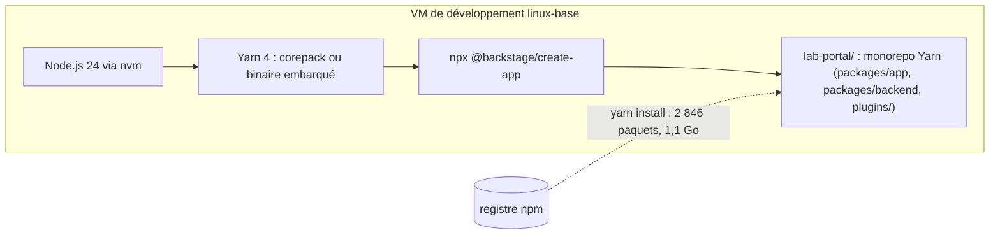
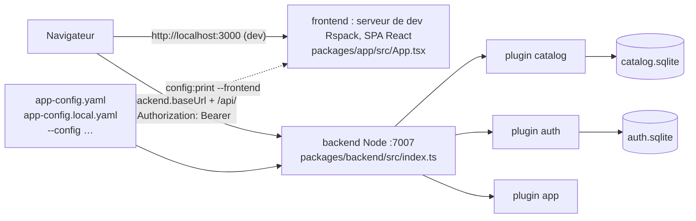

# Backstage — créer une app, la lancer, comprendre ce qui tourne

> Niveau **débutant** · durée **5 h** · profil de lab **linux-base** (une VM de développement) ·
> couvre **CBA-01-01, CBA-01-02, CBA-01-03, CBA-01-04, CBA-03-01, CBA-03-04**.

Statut d'exécution de cette version : la session de rédaction disposait de Node 22.22.0, de `corepack` et du registre npm,
mais pas de navigateur ni d'accès à `repo.yarnpkg.com` ni à `versions.backstage.io`. Ont été exécutés pour de vrai :
`create-app`, `yarn install` (deux fois), `tsc`, `lint`, `test`, `backstage-cli info`, `config:print`, `config:check`,
le backend et le frontend (`yarn start`), les appels d'API avec `curl`, la persistance SQLite et les quatre pannes scriptées.
Sont marqués `[non testé]` avec la raison : l'affichage dans un navigateur, `versions:bump` et le téléchargement de Yarn
par `corepack`. Le statut passera à `validé en conditions réelles` après une exécution complète sur la VM du lab.

Plan validé : `docs/plans/plateforme-01-backstage-premier-lancement.md`. Arbitrages : `DECISIONS.md` (2026-10-02, numérotation
par série). Première fiche du domaine `plateforme` : aucune autre fiche Backstage n'est requise.

## Objectifs mesurables

À la fin de cette fiche tu sais :

- installer Node.js (clé `nodejs` de `versions.yaml`) et Yarn sur une VM Ubuntu vierge, créer une app avec `@backstage/create-app`
  et obtenir une UI qui répond sur le port 3000 en moins de 15 min, téléchargements non comptés ;
- nommer sans notes ce que contient le monorepo généré (`packages/app`, `packages/backend`, `plugins/`, `app-config*.yaml`,
  `backstage.json`, `package.json`, `yarn.lock`, `.yarnrc.yml`) et dire à quoi sert chaque fichier en une phrase ;
- faire tourner la boucle de développement : modifier un composant, lancer `yarn tsc`, `yarn lint`, `yarn test`,
  et interpréter une erreur de typage en moins de 5 min ;
- expliquer ce que font `yarn install` (workspaces, lockfile, `--immutable`), `corepack` et `versions:bump`,
  et prouver qu'une installation est reproductible ;
- décrire l'architecture client-serveur (SPA React sur 3000, backend Node sur 7007, plugins frontend et backend, services
  de base, une base par plugin) en un schéma et 3 phrases, et prouver chaque élément par une commande ;
- lire et modifier la configuration (`app-config.yaml`, `app-config.local.yaml`, `backend.baseUrl`, `backend.database`),
  afficher la configuration effective avec `config:print` et la valider avec `config:check` ;
- diagnostiquer une app qui ne démarre pas ou une UI muette (module natif à recompiler, lockfile modifié, port occupé,
  `baseUrl` incohérente) en moins de 10 min.

## Section 1 — Installer l'outillage et créer l'app

Chaque section suit le cycle ci-dessous, dans cet ordre, sans en sauter.

### Concept (court)

Backstage n'est pas un logiciel que tu installes : c'est un **framework** qui génère une application à toi, un monorepo
TypeScript que tu fais évoluer. Trois couches : le **core** (paquets `@backstage/*` publiés chaque mois), ton **app**
(le monorepo généré, versionné dans ton Git) et les **plugins** (les fonctions : catalogue, TechDocs, les tiens).
Trois outils suffisent pour la lancer : Node.js (le runtime), Yarn 4 (le gestionnaire de paquets, imposé par le gabarit)
et Git. Manipulation dans les 10 lignes : on installe les trois.



### Démo guidée

Sur une VM Ubuntu LTS (`ubuntu_lts`) du profil `linux-base`, dimensionnée 4 vCPU / 8 Go / 60 Go (la documentation Backstage
exige 6 Go de RAM et 20 Go de disque). Les versions viennent de `versions.yaml`, jamais en dur.

```bash
cd ~/WorkbookDevops
yq -r '.components.backstage.version, .components.nodejs.version' versions.yaml
```

Sortie obtenue (exécuté) :

```text
1.55.3
24
```

Node.js par `nvm` (choix du plan validé : installation par utilisateur, celle de la documentation officielle ; NodeSource
en variante pour un provisionnement Ansible). Le paquet `nodejs` d'Ubuntu 24.04 est un 18.x, hors de la plage `22 || 24`
exigée par le gabarit : ne l'installe pas.

```bash
curl -o- https://raw.githubusercontent.com/nvm-sh/nvm/master/install.sh | bash   # lis le script avant, c'est un lab
source ~/.nvm/nvm.sh
NODE_MAJOR=$(yq -r '.components.nodejs.version' versions.yaml)
nvm install "$NODE_MAJOR" && nvm alias default "$NODE_MAJOR"
node -v && corepack enable && corepack --version && git --version
```

`[non testé : la session de rédaction avait Node 22.22.0 et corepack 0.34.0 déjà installés, sans accès à nodejs.org]`.
Création de l'app. `create-app` vérifie les prérequis, demande un nom, copie un gabarit et initialise un dépôt Git.
`--skip-install` sépare la création de l'installation pour mesurer chacune :

```bash
cd ~
npx @backstage/create-app@latest --skip-install    # nom demandé : lab-portal
```

Sortie obtenue (exécuté, abrégée) :

```text
Prerequisites check...

  Node version is: 22.22.0
  Yarn version is: 1.22.22
  Python version is: 3.11.15
? Enter a name for the app [required] lab-portal

Creating the app...
 Preparing files:
  templating    .yarnrc.yml.hbs ✔
  templating    app-config.yaml.hbs ✔
  templating    backstage.json.hbs ✔
  templating    package.json.hbs ✔
  copying       yarn-4.13.0.cjs ✔
  copying       Dockerfile ✔
  copying       App.tsx ✔
  ...
```

Lis ce qui a été généré avant d'installer quoi que ce soit :

```bash
cd ~/lab-portal
ls -a
cat backstage.json
jq '{engines, packageManager, workspaces}' package.json
cat .yarnrc.yml
ls packages/app/src packages/backend/src plugins examples
```

Sortie obtenue (exécuté, abrégée) :

```text
.dockerignore .eslintrc.js .git .gitignore .prettierignore .yarn .yarnrc.yml README.md
app-config.production.yaml app-config.yaml backstage.json catalog-info.yaml examples
package.json packages playwright.config.ts plugins tsconfig.json yarn.lock
{
  "version": "1.55.0"
}
{
  "engines": { "node": "22 || 24" },
  "packageManager": "yarn@4.13.0",
  "workspaces": [ "packages/*", "plugins/*" ]
}
nodeLinker: node-modules
npmMinimalAgeGate: 3d
npmPreapprovedPackages:
  - '@backstage/*'

yarnPath: .yarn/releases/yarn-4.13.0.cjs
```

Quatre choses à retenir de cette sortie :

- `backstage.json` dit la **release** Backstage de l'app (1.55.0, `create-app@latest` du 2026-10-02) ; `versions.yaml` dit 1.55.3 :
  on aligne juste après.
- `packageManager` fixe Yarn **4.13.0**. Deux voies pour l'obtenir : `corepack` lit ce champ et télécharge Yarn ; ou le binaire
  **embarqué** `.yarn/releases/yarn-4.13.0.cjs`, désigné par `yarnPath`, qui marche sans réseau et sans corepack
  (`node .yarn/releases/yarn-4.13.0.cjs --version`). Le « Yarn 1.22.22 » du contrôle de prérequis est le shim de corepack,
  pas la version qui sera utilisée.
- `npmMinimalAgeGate: 3d` refuse toute version npm publiée depuis moins de trois jours, sauf `@backstage/*` : protection
  contre les paquets compromis, nouveauté du gabarit 1.55.
- `workspaces` : `packages/*` (ton app et ton backend) et `plugins/*` (vide, tes futurs plugins). Un seul `yarn.lock` pour tout.

Installation des dépendances, mesurée :

```bash
time yarn install
du -sh node_modules ~/.yarn/berry/cache
wc -l yarn.lock
```

Sortie obtenue (exécuté, abrégée) :

```text
➤ YN0000: · Yarn 4.13.0
➤ YN0000: ┌ Resolution step
➤ YN0000: └ Completed in 55s
➤ YN0000: ┌ Fetch step
➤ YN0013: │ 2846 packages were added to the project (+ 1.1 GiB).
➤ YN0000: └ Completed in 56s
➤ YN0000: ┌ Link step
➤ YN0007: │ better-sqlite3@npm:12.11.1 must be built because it never has been before or the last one failed
➤ YN0000: └ Completed in 1m 18s
➤ YN0000: · Done with warnings in 2m 50s

real    2m52.749s
1.9G    node_modules
1.2G    /root/.yarn/berry/cache
32628 yarn.lock
```

Trois étapes : **résolution** (le lockfile du gabarit est vide, Yarn calcule l'arbre complet), **fetch** (1,1 Go dans le cache
global), **link** (copie dans `node_modules`, compilation du module natif `better-sqlite3`). Une seconde installation
sur le même poste tient en 6 s : le cache fait le travail.

Point de vigilance daté (exécuté le 2026-10-02) : la première installation a échoué à la résolution avec
`got@patch:got@npm%3A11.8.2#~/.yarn/patches/got-npm-11.8.2-c1eb105458.patch: ENOENT`. Cause : `@yarnpkg/core` 4.9.2, publié
le 2026-09-24 avec une dépendance `patch:` relative à son propre dépôt (bug yarnpkg/berry#7281), tiré par `@backstage/cli` 0.36.6.
Contournement, à retirer dès qu'une 4.9.3 corrigée existe :

```bash
jq '.resolutions["@yarnpkg/core"] = "4.9.1"' package.json > package.json.new && mv package.json.new package.json
yarn install
```

Aligne ensuite l'app sur la release de `versions.yaml`, puis lance :

```bash
yarn backstage-cli versions:bump --release "$(yq -r '.components.backstage.version' ~/WorkbookDevops/versions.yaml)"
cat backstage.json      # attendu : 1.55.3
yarn start
```

`[non testé : versions.backstage.io, qui sert le manifeste de chaque release, est bloqué depuis la session de rédaction ;
la commande a répondu « Unexpected response status 403 »]`. `yarn start` lance deux processus dans la même fenêtre
(`Starting app, backend`) : le serveur de développement du frontend et le backend, sorties entremêlées.
Ouvre `http://localhost:3000` (tunnel SSH `-L 3000:localhost:3000 -L 7007:localhost:7007` depuis ton poste), connecte-toi
en invité (« Enter »). Depuis une autre fenêtre :

```bash
curl -s -o /dev/null -w '%{http_code}\n' http://localhost:3000/
curl -s http://localhost:7007/.backstage/health/v1/readiness
```

Sortie obtenue (exécuté) :

```text
200
{
  "status": "ok"
}
```

L'affichage de la page dans un navigateur est `[non testé : pas de navigateur dans la session de rédaction]` ; le HTML servi
sur 3000 porte bien `<title>Scaffolded Backstage App</title>`.

### Exercice autonome

1. Sur un **second utilisateur Unix** de la même VM, recrée l'app sans relire la démo, en pinnant la release dès le départ
   (`versions:bump --release` avant le premier `yarn start`). Mesure et note dans `journal/` : durée de `create-app`, durée de
   `yarn install` à froid (cache vide : `yarn cache clean --all` avant) puis à chaud, taille de `node_modules` et du cache.
2. Sans corepack (`corepack disable`), lance `yarn --version` puis `node .yarn/releases/yarn-4.13.0.cjs --version`.
   Explique en deux phrases pourquoi l'un échoue et l'autre non, et lequel utilisera un Dockerfile.
3. Commite l'app dans un dépôt Git (`git add -A && git commit`), puis liste ce que `.gitignore` exclut et pourquoi
   `.yarn/releases` est **gardé** alors que `.yarn/cache` ne l'est pas.

Compétences couvertes : `CBA-01-01`, `CBA-01-04`.

### Break-fix

Script : `break/plateforme/01-backstage-node-version.sh` — injecte la panne, `--undo` la retire, `--reveal` l'explique
(`NN` = numéro de la fiche, DECISIONS.md 2026-10-02). Variable `APP_DIR` si ton app n'est pas dans `~/lab-portal`.

Symptôme : `yarn start` affiche `Rspack compiled successfully` côté frontend ; le backend s'arrête avec
`Acquire connection error: Error: Could not locate the bindings file` et trois chemins `better_sqlite3.node` essayés.
`yarn install` ne se plaint de rien.

### Défi chronométré

Depuis une VM où Node n'est pas installé : Node à la version `nodejs`, app créée, release alignée sur `versions.yaml`,
UI qui répond sur 3000 et `readiness` à `ok` sur 7007. **15 min**, temps de téléchargement exclu (chronomètre en pause
pendant `nvm install`, `create-app` et `yarn install`). Critère : `cat backstage.json` affiche la version de `versions.yaml`
et `curl -s http://localhost:7007/.backstage/health/v1/readiness` répond `{"status":"ok"}`.

## Section 2 — La boucle de développement

### Concept (court)

Tout passe par `backstage-cli`, le CLI du framework, derrière des scripts du `package.json` racine : `yarn start` (`repo start`),
`yarn tsc` (vérification de types), `yarn lint` / `yarn lint:all` (`repo lint`), `yarn test` (`repo test`, Jest), `yarn fix`,
`yarn build:backend`, `yarn new`. TypeScript ne **compile** pas l'app ici : `yarn tsc` vérifie les types et n'émet que des
déclarations (`dist-types/`), le bundling est fait par `backstage-cli` au build. Manipulation dans les 10 lignes.

### Démo guidée

Lis d'abord les scripts, puis vérifie l'état de l'app :

```bash
jq .scripts package.json
yarn backstage-cli info | head -6
```

Sortie obtenue (exécuté, abrégée) :

```text
{
  "start": "backstage-cli repo start",
  "build:backend": "yarn workspace backend build",
  "build:all": "backstage-cli repo build --all",
  "build-image": "yarn workspace backend build-image",
  "tsc": "tsc",
  "tsc:full": "tsc --skipLibCheck false --incremental false",
  "clean": "backstage-cli repo clean",
  "test": "backstage-cli repo test",
  "test:all": "backstage-cli repo test --coverage",
  "fix": "backstage-cli repo fix",
  "lint": "backstage-cli repo lint --since origin/master",
  "lint:all": "backstage-cli repo lint",
  "new": "backstage-cli new"
}
OS:   Linux 6.18.44-fc-v51 - linux/x64
node: v22.22.0
yarn: 4.13.0
cli:  0.36.6 (installed)
info module: 0.1.4
backstage:   1.55.0
```

`yarn lint` sans `:all` ne regarde que les fichiers modifiés depuis `origin/master` : sur un dépôt sans remote, utilise `lint:all`.
Les trois vérifications, mesurées :

```bash
time yarn tsc
time yarn lint:all
time CI=true yarn test
```

Sortie obtenue (exécuté, abrégée) :

```text
real    0m9.258s                      # tsc : aucune sortie quand tout va bien
Checked   1 files in packages/backend 1.68s
Checked  12 files in packages/app 2.36s
real    0m4.126s
PASS app packages/app/src/App.test.tsx (13.895 s)
Test Suites: 1 passed, 1 total
Tests:       1 passed, 1 total
real    0m17.551s
```

`CI=true` empêche Jest de rester en mode interactif. Provoque maintenant une erreur de type pour apprendre à la lire :
ajoute une propriété inconnue à `createApp` dans `packages/app/src/App.tsx` (par exemple `titre: 42,` sous `features`),
puis :

```bash
yarn tsc
```

Sortie obtenue (exécuté) :

```text
packages/app/src/App.tsx:8:3 - error TS2353: Object literal may only specify known properties,
  and 'titre' does not exist in type 'CreateAppOptions'.

8   titre: 42,
    ~~~~~

Found 1 error in packages/app/src/App.tsx:8
```

Fichier, ligne, colonne, code `TS2353`, et le **type attendu** (`CreateAppOptions`) : c'est lui que tu vas lire dans
`node_modules/@backstage/frontend-defaults` quand tu ne sais pas quelle propriété existe. Retire la ligne, `yarn tsc` redevient
silencieux. Dépendances maintenant. Le monorepo a trois workspaces ; une dépendance s'ajoute **à un workspace**, pas à la racine :

```bash
yarn workspaces list
yarn why react | head -4
yarn workspace backend add node-fetch@3          # exemple : ajoute au backend seulement
git diff --stat                                   # package.json du backend et yarn.lock ont bougé
yarn workspace backend remove node-fetch
yarn install --immutable && echo "lockfile stable"
```

Sortie obtenue (exécuté pour `workspaces list` et `why` ; `add` / `remove` `[non testé : lockfile volontairement laissé intact
dans la session de rédaction]`) :

```text
➤ YN0000: .
➤ YN0000: packages/app
➤ YN0000: packages/backend
├─ @yarnpkg/plugin-interactive-tools@npm:4.1.1
│  └─ react@npm:17.0.2 (via npm:^17.0.2)
```

`--immutable` est le mode de la CI et du `Dockerfile` : si `yarn.lock` devait changer, l'installation échoue au lieu de le réécrire.
Dernier outil : la montée de version. Backstage publie une release par mois ; `versions:bump` réécrit toutes les plages
`@backstage/*` des `package.json` d'après le manifeste de la release, puis lance `yarn install` et les migrations de paquets
renommés.

```bash
yarn backstage-cli versions:bump --help
```

Sortie obtenue (exécuté, abrégée) :

```text
FLAGS:
      --pattern <string>        Override glob for matching packages to upgrade
      --release <string>        Bump to a specific Backstage release line or version (default: "main")
      --skip-install            Skips yarn install step
      --skip-migrate            Skips migration of any moved packages
```

Sans `--release`, le défaut est `main` : la **prochaine** release, pas celle de `versions.yaml`. Toujours passer `--release`.

### Exercice autonome

1. Depuis un **clone frais** du dépôt Git de l'app (exercice 3 de la section 1), installe en mode immuable et fais passer
   `tsc`, `lint:all` et `test`. Écris un `Makefile` avec une cible `check` qui enchaîne les trois et s'arrête à la première erreur.
2. Ajoute une dépendance au backend seulement (`yarn workspace backend add …`), prouve avec `yarn why` et `jq` que le frontend
   ne la voit pas, puis retire-la. Vérifie que `git status` est propre et que `yarn install --immutable` passe.
3. Modifie le texte d'accueil dans `packages/app/src/modules/home/homeModule.tsx` et le titre dans `app-config.yaml`
   (`app.title`), observe le rechargement dans le navigateur, puis `yarn test` : le test `App.test.tsx` passe-t-il encore ?
   Pourquoi ne teste-t-il pas ton titre ?

Compétences couvertes : `CBA-01-02`, `CBA-01-03`, `CBA-01-04`.

### Break-fix

Script : `break/plateforme/01-backstage-lockfile-corepack.sh` — injecte la panne, `--undo` la retire, `--reveal` l'explique.

Symptôme : `yarn --version` échoue sur une erreur réseau de corepack ; une fois Yarn relancé autrement,
`yarn install --immutable` affiche un diff de `yarn.lock` (`YN0028`) et se termine par
`The lockfile would have been modified by this install, which is explicitly forbidden.`

### Défi chronométré

Un dépôt t'est fourni avec trois défauts injectés (une erreur de type, une erreur de lint, un test en échec). Les trouver, les corriger,
`make check` vert. **10 min.** Critère : `yarn tsc && yarn lint:all && CI=true yarn test` sort en code 0.

## Section 3 — Ce qui tourne : client, serveur, configuration

### Concept (court)

Deux processus. Le **frontend** est une application React (une SPA) servie en développement par un serveur Rspack sur le port 3000 ;
en production, le backend la sert lui-même. Le **backend** est un processus Node sur le port 7007 qui charge des **plugins backend**
(`catalog`, `auth`, `scaffolder`, `techdocs`…), chacun avec sa route `/api/<pluginId>` et sa **propre base** (SQLite en développement,
PostgreSQL en production). Le navigateur appelle l'API à l'adresse `backend.baseUrl`, avec un jeton obtenu du plugin `auth` :
sans jeton, 401. Tout est décrit dans `app-config.yaml`, surchargé par `app-config.local.yaml` (ignoré par Git) et par les
fichiers passés en `--config`. Manipulation dans les 10 lignes.



### Démo guidée

Lance `yarn start` et lis les premières lignes. Les deux processus écrivent dans la même fenêtre : les lignes `<i> [webpack-dev-server]`
et `Rspack compiled` viennent du frontend, les lignes horodatées avec un nom de service (`rootHttpRouter`, `catalog`, `auth`) du backend.

```bash
yarn start 2>&1 | head -14
```

Sortie obtenue (exécuté, abrégée, couleurs retirées) :

```text
Starting app, backend
Loaded config from app-config.yaml
<i> [webpack-dev-server] Project is running at:
<i> [webpack-dev-server] Loopback: http://localhost:3000/, http://127.0.0.1:3000/
Loading config from MergedConfigSource{FileConfigSource{path=".../app-config.yaml"}, EnvConfigSource{...}}
2026-10-02T22:34:05.821Z backstage info Found 2 new secrets in config that will be redacted
2026-10-02T22:34:05.862Z rootHttpRouter info Listening on :7007
2026-10-02T22:34:05.868Z backstage info Plugin initialization started: 'app', 'auth', 'catalog', 'kubernetes', ...
Rspack compiled successfully
2026-10-02T22:34:06.953Z kubernetes warn Failed to initialize kubernetes backend: valid kubernetes config is missing
2026-10-02T22:34:07.156Z catalog info Performing database migration
2026-10-02T22:34:07.458Z auth info Configuring auth provider: guest
2026-10-02T22:34:07.749Z catalog warn Event subscribe request failed with status 404, events backend not found. ...
2026-10-02T22:34:08.xxxZ backstage info Plugin initialization complete, newly initialized: 'scaffolder', 'notifications', 'catalog'
```

Le backend écoute moins d'une seconde après le chargement de la configuration et finit d'initialiser ses plugins 2 s plus tard ;
le frontend est compilé par Rspack dans le même temps. Les avertissements `kubernetes` et `events backend not found` sont normaux
sur une app vierge. Mémoire mesurée au repos : backend 320 Mo, serveur de développement
du frontend 1,5 Go (c'est lui qui justifie les 8 Go de la VM). D'où vient la liste des plugins ? De `packages/backend/src/index.ts` :

```bash
grep -c "backend.add" packages/backend/src/index.ts
sed -n '1,20p' packages/backend/src/index.ts
```

Sortie obtenue (exécuté, abrégée) :

```text
22
import { createBackend } from '@backstage/backend-defaults';

const backend = createBackend();

backend.add(import('@backstage/plugin-app-backend'));
backend.add(import('@backstage/plugin-proxy-backend'));
backend.add(import('@backstage/plugin-scaffolder-backend'));
...
backend.start();
```

Un backend = `createBackend()` + un `backend.add(...)` par plugin ou module + `backend.start()`. Chaque plugin reçoit des
**services de base** (logger, base de données, routeur HTTP, planificateur) sans que tu les câbles : c'est le **nouveau système
de backend**, celui généré depuis la release 1.24. Le frontend a la même forme depuis 1.55 (`packages/app/src/App.tsx`) :

```bash
cat packages/app/src/App.tsx
```

Sortie obtenue (exécuté) :

```text
import { createApp } from '@backstage/frontend-defaults';
import catalogPlugin from '@backstage/plugin-catalog/alpha';
import { navModule } from './modules/nav';
import { homeModule } from './modules/home';

export default createApp({
  features: [catalogPlugin, navModule, homeModule],
});
```

Maintenant l'API. Appelle le catalogue comme le ferait le navigateur, d'abord sans jeton :

```bash
curl -s http://localhost:7007/api/catalog/entities | jq -c '.error | {name, message}'
TOKEN=$(curl -s -H 'X-Requested-With: XMLHttpRequest' http://localhost:7007/api/auth/guest/refresh \
        | jq -r '.backstageIdentity.token')
echo "$TOKEN" | cut -d. -f2 | base64 -d 2>/dev/null | jq -c '{sub, exp}'
curl -s -H "Authorization: Bearer $TOKEN" 'http://localhost:7007/api/catalog/entities?filter=kind=component' \
  | jq -r '.[] | "\(.kind)/\(.metadata.name)  owner=\(.spec.owner)"'
curl -s -H "Authorization: Bearer $TOKEN" http://localhost:7007/api/catalog/entities | jq length
```

Sortie obtenue (exécuté) :

```text
{"name":"AuthenticationError","message":"Missing credentials"}
{"sub":"user:development/guest","exp":1790983101}
Component/example-website  owner=guests
9
```

Le jeton vient du plugin `auth`, fournisseur `guest` (`auth.providers.guest` dans `app-config.yaml`) ; l'en-tête
`X-Requested-With` est exigé par ce point d'entrée. Les 9 entités viennent des trois `catalog.locations` de type `file`
d'`app-config.yaml` (`examples/`). Configuration, maintenant : ce que le backend a réellement chargé, et ce que le navigateur en voit.

```bash
yarn backstage-cli config:check
yarn backstage-cli config:print --lax --format json | jq '{app_baseUrl:.app.baseUrl, backend_baseUrl:.backend.baseUrl,
  listen:.backend.listen, database:.backend.database, cors_origin:.backend.cors.origin}'
yarn backstage-cli config:print --frontend --lax | grep -c .
```

Sortie obtenue (exécuté) :

```text
Loaded config from app-config.yaml
{
  "app_baseUrl": "http://localhost:3000",
  "backend_baseUrl": "http://localhost:7007",
  "listen": { "port": 7007 },
  "database": { "client": "better-sqlite3", "connection": "<secret>" },
  "cors_origin": "http://localhost:3000"
}
96
```

`config:print` masque les secrets (`<secret>`, `--with-secrets` pour les voir) ; `--lax` tolère les variables d'environnement
absentes (`${GITHUB_TOKEN}`) ; `--frontend` ne garde que les clés marquées visibles côté navigateur dans les schémas de
configuration des paquets. `config:check` valide le tout contre ces mêmes schémas. La base est **en mémoire** : prouve-le.
Enregistre un composant par l'API, redémarre, recompte. Le lab n'a pas de jeton GitHub : on sert un `catalog-info.yaml` en HTTP
local et on autorise cet hôte en lecture (`backend.reading.allow`), dans `app-config.local.yaml` :

```bash
mkdir -p ~/www && cp ~/WorkbookDevops/fiches/plateforme/01-backstage-premier-lancement/config/catalog-info.exemple.yaml \
  ~/www/catalog-info.yaml
(cd ~/www && python3 -m http.server 8000 --bind 127.0.0.1 &)
printf 'backend:\n  reading:\n    allow:\n      - host: localhost:8000\n' > app-config.local.yaml
yarn start        # relance pour charger app-config.local.yaml ; dans une autre fenêtre :
TOKEN=$(curl -s -H 'X-Requested-With: XMLHttpRequest' http://localhost:7007/api/auth/guest/refresh | jq -r '.backstageIdentity.token')
curl -s -X POST -H "Authorization: Bearer $TOKEN" -H 'Content-Type: application/json' \
  http://localhost:7007/api/catalog/locations -d '{"type":"url","target":"http://localhost:8000/catalog-info.yaml"}' | jq -c '.location.id'
sleep 6; curl -s -H "Authorization: Bearer $TOKEN" http://localhost:7007/api/catalog/entities | jq length
# Ctrl-C sur yarn start, relance, recompte :
curl -s -H "Authorization: Bearer $TOKEN" http://localhost:7007/api/catalog/entities | jq length
```

Sortie obtenue (exécuté, backend seul) :

```text
"1abd5f0d-73a0-4343-b432-17e14a1d59a6"
11
9
```

11 = 9 + la `Location` + le `Component`. Après redémarrage : 9, tout a disparu. SQLite sur fichier, un fichier par plugin
(`fiches/plateforme/01-backstage-premier-lancement/config/app-config.sqlite-fichier.yaml`, chemin relatif à `packages/backend`) :

```bash
cp ~/WorkbookDevops/fiches/plateforme/01-backstage-premier-lancement/config/app-config.sqlite-fichier.yaml app-config.sqlite.yaml
yarn start --config app-config.yaml --config app-config.local.yaml --config app-config.sqlite.yaml
# autre fenêtre : même POST qu'au-dessus, puis
ls .sqlite/
# Ctrl-C, relance avec les mêmes --config, recompte
```

Sortie obtenue (exécuté, backend seul) :

```text
app.sqlite       catalog.sqlite     mcp-actions.sqlite    permission.sqlite  scaffolder.sqlite  signals.sqlite   user-settings.sqlite
auth.sqlite      kubernetes.sqlite  notifications.sqlite  proxy.sqlite       search.sqlite      techdocs.sqlite
11
```

Avec `--config`, la liste **remplace** la liste par défaut (`app-config.yaml` + `app-config.local.yaml`) : il faut redonner
les deux premiers. Les chemins sont relatifs au répertoire d'où `backstage-cli` est lancé : depuis la racine avec `yarn start`,
depuis `packages/backend` avec `yarn workspace backend start`. C'est le piège classique des `type: file` du catalogue, résolus
eux aussi depuis `packages/backend` (regarde `../../examples/entities.yaml` dans `app-config.yaml`).

### Exercice autonome

1. Expose l'app aux autres VM du lab : à partir de `config/app-config.lab.yaml`, écris un `app-config.local.yaml` avec le nom DNS
   de ta VM (`<vm>.lab.home.arpa`), `backend.listen.host: 0.0.0.0`, `app.baseUrl` / `backend.baseUrl` / `backend.cors.origin`
   cohérents, ouvre 3000 et 7007 dans `ufw`. Depuis une **seconde VM** `linux-base`, `curl` la `readiness`, obtiens un jeton invité
   et liste les composants ; depuis ton poste, ouvre l'UI par le nom DNS.
2. Retire `@backstage/plugin-techdocs-backend` de `index.ts`, relance, puis `curl` `/api/techdocs/…` avec jeton : quel code HTTP ?
   Remets-le. Même question en retirant `plugin-auth-backend` : que se passe-t-il, et à quelle étape ?
3. Dessine toi-même le schéma de la section (Mermaid dans `journal/`) en remplaçant chaque flèche par la commande qui la prouve
   (`curl`, `grep`, `config:print`). Une flèche sans commande n'a pas sa place.

Compétences couvertes : `CBA-03-01`, `CBA-03-02` (introduit), `CBA-03-04`.

### Break-fix

Scripts : `break/plateforme/01-backstage-baseurl.sh` et `break/plateforme/01-backstage-port-occupe.sh` — injectent la panne,
`--undo` la retirent, `--reveal` l'expliquent.

Symptôme (baseurl) : l'UI se charge, le catalogue reste vide, la console du navigateur montre des erreurs réseau puis CORS ;
`curl http://localhost:7007/.backstage/health/v1/readiness` répond `200`.

Symptôme (port-occupe) : `yarn start` affiche `backstage error Unhandled rejection listen EADDRINUSE: address already in use 0.0.0.0:7007` ;
`curl http://localhost:7007/` renvoie une page HTML qui n'est pas Backstage.

### Défi chronométré

Une app t'est fournie avec une panne tirée au sort parmi les quatre scripts de la fiche (`break.sh random`). La diagnostiquer et la
corriger. **10 min.** Critère : `readiness` à `ok`, `curl` du catalogue avec jeton qui liste `example-website`, et la cause
expliquée en une phrase dans `journal/`.

## Checklist de maîtrise

À cocher honnêtement, en conditions réelles (terminal seul, documentation officielle, minuteur).

- [ ] Je sais installer Node (`nodejs`), créer une app, l'aligner sur `versions.yaml` et obtenir l'UI en moins de 15 min hors téléchargements
- [ ] Je sais expliquer `backstage.json`, `packageManager`, `yarnPath`, `workspaces` et `yarn.lock` en une phrase chacun sans notes
- [ ] Je sais lire une erreur de `yarn tsc` (fichier, ligne, code, type attendu) et la corriger en moins de 5 min
- [ ] Je sais prouver qu'une installation est reproductible (`yarn install --immutable` sur un clone frais) en moins de 5 min
- [ ] Je sais dessiner et prouver par des commandes l'architecture frontend / backend / plugins / bases en moins de 10 min
- [ ] Je sais afficher la configuration effective, la valider et expliquer `baseUrl` vs `listen` en 3 phrases sans notes
- [ ] Je sais diagnostiquer les quatre pannes de la fiche en moins de 10 min chacune

## Points de vigilance (versions)

- `backstage` 1.55.3 dans `versions.yaml` ; `create-app@latest` (0.9.2 le 2026-10-02) génère une app en **1.55.0** : l'alignement
  par `versions:bump --release` fait partie de la création, pas de la maintenance.
- `nodejs` 24 (Active LTS jusqu'au 2028-04-30) ; le gabarit accepte `22 || 24` et son `Dockerfile` part de `node:24-trixie-slim`.
  Node 20 est en fin de vie depuis le 2026-04-30. **Yarn 4 n'applique pas `engines.node`** : une mauvaise version ne se voit
  qu'au démarrage du backend (module natif `better-sqlite3`), d'où la panne scriptée.
- Yarn **4.13.0** pinné par `packageManager` ; la documentation « Getting started » cite encore 4.4.1 et la dernière Yarn est 4.18.1 :
  la version qui compte est celle du `packageManager` de **ton** app, lue par corepack, ou le binaire `.yarn/releases/` embarqué.
- `@yarnpkg/core` 4.9.2 (2026-09-24) casse la résolution (`got@patch:` relatif, yarnpkg/berry#7281) ; `resolutions` à 4.9.1 en
  attendant la correction. À retirer à la veille suivante.
- Nouveau **système de frontend** généré par défaut depuis 1.55 (`createApp` de `@backstage/frontend-defaults`, `app.packages: all`,
  `app.extensions`) ; la barre latérale importe encore `@material-ui/icons` (MUI v4). Le programme CBA date d'octobre 2024 :
  l'ancien `App.tsx` (`createApp` de `@backstage/app-defaults`, `FlatRoutes`, `apis.ts`) peut apparaître dans les questions.
- Ancien système de **backend** à connaître pour l'examen : un fichier par plugin dans `packages/backend/src/plugins/` exportant
  `createPlugin(env: PluginEnvironment)` avec `createRouter`, assemblés à la main dans `index.ts`. Depuis 1.24, `createBackend` +
  `backend.add`. Les flashcards reprennent les deux formes.
- `npmMinimalAgeGate: 3d` dans `.yarnrc.yml` : une dépendance publiée il y a moins de trois jours est refusée. Si `yarn add` échoue
  sur une version toute neuve, c'est voulu ; attends ou ajoute le paquet à `npmPreapprovedPackages` en connaissance de cause.
- Les points d'entrée `/api/*` exigent un jeton depuis la nouvelle authentification de service (1.26) : `curl` nu = 401.
  `backend.auth.dangerouslyDisableDefaultAuthPolicy: true` existe pour le développement ; ne l'utilise pas, apprends le jeton.

## Liens

- Solutions (3 indices puis correction commentée) : `solutions/fiches/plateforme/01-backstage-premier-lancement.md`
- Pannes scriptées : `break/plateforme/`
- Flashcards (10 à 20, CSV `question;réponse;tags`) : `revision/flashcards/plateforme-01-backstage-premier-lancement.csv`
- Mapping certification : `certifs/CBA/objectifs.md`
- Rappel espacé : séances J+1, J+7, J+30 à noter dans `journal/`
