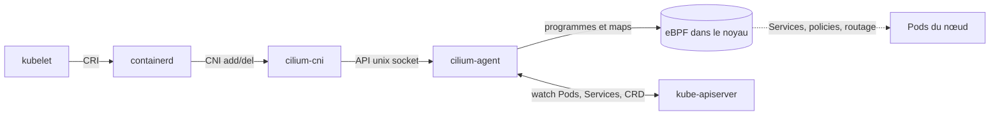
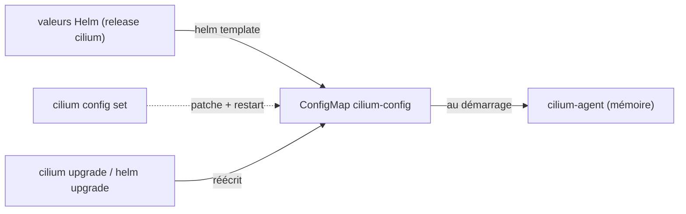
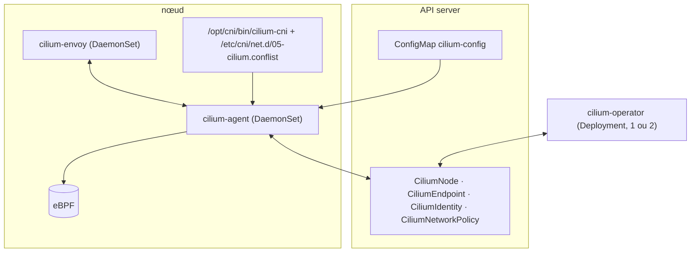

# Cilium — installer avec le CLI, lire l'architecture, tester la connectivité

> Niveau **confirmé** · durée **5 h** · profil de lab **linux-base** (kind sur une VM ; variante **kubernetes-ha**) ·
> couvre **CCA-01-01, CCA-01-02, CCA-01-04, CCA-05-01, CCA-05-02** (+ CKA-05-07, KCNA-02-01, KCSA-02-09, à confirmer par leur cartographie).

Statut d'exécution de cette version : toutes les commandes marquées « exécuté » ont tourné le 2026-10-02 sur un cluster `kind`
à trois nœuds (image `kindest/node:v1.37.0`, Cilium 1.20.2, CLI 0.20.1) dans la session de rédaction. Cette session avait cinq
contraintes qui ne sont pas celles du lab : `quay.io` et `helm.cilium.io` bloqués (images prises sur le miroir officiel
`docker.io/cilium/*`, chart lu depuis le dépôt Git de Cilium à la version 1.20.2), image `cilium-envoy` absente du miroir
(`envoy.enabled=false`, Envoy embarqué), capacité `CAP_SYS_RESOURCE` interdite par le bac à sable (retirée des listes du chart),
hôte en cgroup v1 (patch kubelet `failCgroupV1: false` et containerd `restrict_oom_score_adj`). Les sorties reproduites sont réelles ;
ce qui n'a pas pu tourner est marqué `[non testé]` avec la raison. Le statut passera à `validé en conditions réelles` après une
exécution sur le lab.

Plan validé : `docs/plans/reseau-10-cilium-installation-architecture.md`. Arbitrages : `DECISIONS.md` (2026-10-02 : série Cilium
numérotée 10 à 16, kube-proxy absent et `kubeProxyReplacement`, LB-IPAM + BGP, Gateway API Cilium, Helm 4).

## Objectifs mesurables

À la fin de cette fiche tu sais :

- expliquer sans notes, en trois phrases, ce que Cilium remplace dans un cluster (CNI, kube-proxy, NetworkPolicy, observabilité)
  et ce qu'il ne remplace pas (API server, CoreDNS, runtime) ;
- installer le CLI `cilium` à la version `cilium_cli`, installer Cilium à la version `cilium` sur un cluster sans CNI ni kube-proxy
  et obtenir `cilium status --wait` sans erreur en moins de 15 min ;
- nommer sans notes `cilium-agent`, `cilium-operator`, `cilium-envoy`, `cilium-cni`, `hubble-relay`, `clustermesh-apiserver` et les CRD
  `CiliumNode`, `CiliumEndpoint`, `CiliumIdentity`, `CiliumNetworkPolicy`, et dire en une phrase ce que fait chacun ;
- lire et modifier la configuration avec `cilium config view`, `cilium config set` et `helm get values`, et prédire si un changement
  demande un redémarrage des agents, en moins de 5 min ;
- lancer `cilium connectivity test`, lire un rapport d'échec et remonter à la cause en moins de 10 min ;
- produire un `cilium sysdump` et y retrouver la configuration effective d'un agent et ses logs en moins de 5 min ;
- dire ce qui continue de fonctionner quand `cilium-operator` est arrêté, et quand l'agent d'un nœud est arrêté, après l'avoir vérifié.

## Section 1 — Un cluster sans CNI ni kube-proxy, puis Cilium

Chaque section suit le cycle ci-dessous, dans cet ordre, sans en sauter.

### Concept (court)

Kubernetes ne sait pas faire de réseau. Il demande deux choses à des composants externes : brancher chaque Pod (le plugin **CNI**,
appelé par containerd via `/etc/cni/net.d/`) et faire marcher les Services (**kube-proxy**, par défaut en iptables). Cilium prend
les deux rôles avec des programmes eBPF chargés dans le noyau de chaque nœud, et y ajoute les NetworkPolicy et l'observabilité
(Hubble, fiche 13). Il ne remplace ni l'API server, ni CoreDNS, ni le runtime.



Tu vas le voir à l'envers : un cluster **sans** CNI ni kube-proxy, cassé par construction, puis Cilium qui le rend `Ready`.

### Démo guidée

Sur la VM `linux-base-lx01` (Docker installé). Le cluster `kind` est décrit par un fichier, pas par des options :

```bash
cd fiches/reseau/10-cilium-installation-architecture/manifests
cat kind-config.yaml        # disableDefaultCNI: true, kubeProxyMode: none, image 1.37.0 avec digest
kind create cluster --config kind-config.yaml     # exécuté : 25 s
kubectl get nodes
kubectl -n kube-system get pods -o wide
kubectl -n kube-system get ds                     # pas de kube-proxy
docker exec cilium-lab-worker ls /etc/cni/net.d/  # vide
```

Sortie réelle (exécuté) :

```text
NAME                       STATUS     ROLES           AGE   VERSION
cilium-lab-control-plane   NotReady   control-plane   15s   v1.37.0
cilium-lab-worker          NotReady   <none>          0s    v1.37.0
cilium-lab-worker2         NotReady   <none>          0s    v1.37.0

coredns-559f6c778d-pckx5    0/1   Pending   0   4s   <none>   <none>
coredns-559f6c778d-pvkdj    0/1   Pending   0   4s   <none>   <none>
etcd-cilium-lab-control-plane              1/1   Running   (hostNetwork)
kube-apiserver-cilium-lab-control-plane    1/1   Running   (hostNetwork)
```

Les nœuds sont `NotReady` (le kubelet signale « network plugin not ready »), CoreDNS est `Pending` (impossible de le brancher),
les composants du control plane tournent parce qu'ils sont en `hostNetwork`. Aucun DaemonSet `kube-proxy`.

Installe le CLI à la version `cilium_cli` de `versions.yaml`, avec vérification de la somme (exécuté, `OK`) :

```bash
CILIUM_CLI_VERSION=v0.20.1          # versions.yaml: cilium_cli
curl -L --fail --remote-name-all \
  "https://github.com/cilium/cilium-cli/releases/download/${CILIUM_CLI_VERSION}/cilium-linux-amd64.tar.gz"{,.sha256sum}
sha256sum --check cilium-linux-amd64.tar.gz.sha256sum
sudo tar xzvfC cilium-linux-amd64.tar.gz /usr/local/bin
cilium version --client
```

```text
cilium-cli: v0.20.1 compiled with go1.27.1 on linux/amd64
cilium image (default): v1.20.1
cilium image (stable): v1.20.2
```

Lis bien : le CLI 0.20.1 installe **1.20.1** par défaut, pas la 1.20.2 de `versions.yaml`. Toujours `--version`.

```bash
cilium install --version 1.20.2 \                     # versions.yaml: cilium
  --set kubeProxyReplacement=true \
  --set k8sServiceHost=172.18.0.2 --set k8sServicePort=6443   # adresse réelle de l'API : sans kube-proxy, le Service 10.96.0.1 n'existe pas encore
cilium status --wait
```

Sur `kind`, le CLI détecte l'adresse de l'API tout seul (« Detecting real Kubernetes API server addr and port on Kind ») ;
sur `kubernetes-ha`, mets la VIP `10.10.40.220` (`labs/network.md` §5). Sortie réelle (exécuté, agents prêts en 40 s) :

```text
🔮 Auto-detected Kubernetes kind: kind
ℹ️  Using Cilium version 1.20.2
🔮 Auto-detected cluster name: kind-cilium-lab
🔮 Auto-detected kube-proxy has not been installed
ℹ️  Cilium will fully replace all functionalities of kube-proxy

    /¯¯\
 /¯¯\__/¯¯\    Cilium:             OK
 \__/¯¯\__/    Operator:           OK
 /¯¯\__/¯¯\    Envoy DaemonSet:    disabled (using embedded mode)   # OK sur le lab : "OK" avec le DaemonSet cilium-envoy
 \__/¯¯\__/    Hubble Relay:       disabled
    \__/       ClusterMesh:        disabled

DaemonSet              cilium                   Desired: 3, Ready: 3/3, Available: 3/3
Deployment             cilium-operator          Desired: 1, Ready: 1/1, Available: 1/1
Containers:            cilium                   Running: 3
                       cilium-operator          Running: 1
Cluster Pods:          3/3 managed by Cilium
Helm chart version:    1.20.2
```

```bash
kubectl get nodes                      # Ready, Ready, Ready
kubectl -n kube-system get pods -o wide | grep coredns     # Running, IP en 10.244.1.x
docker exec cilium-lab-worker cat /etc/cni/net.d/05-cilium.conflist
```

```json
{
  "cniVersion": "1.0.0",
  "name": "cilium",
  "plugins": [ { "type": "cilium-cni", "enable-debug": false, "log-file": "/var/run/cilium/cilium-cni.log" } ]
}
```

Variante `kubernetes-ha` `[non testé : profil non levé]` : `kubeadm init --skip-phases=addon/kube-proxy` sur `cp01`
(doc officielle `Documentation/installation/k8s-install-kubeadm.rst` de la version 1.20.2), `kubeadm join` des autres nœuds,
puis exactement le même `cilium install` avec `k8sServiceHost=10.10.40.220`.

### Exercice autonome

1. Applique `manifests/demo-web.yaml` (deux `nginx` forcés sur deux nœuds différents, un Service `ClusterIP`, un client `busybox`).
   Depuis le client, joins chaque Pod par son IP, puis le Service par son nom. Note sur quel nœud est chaque Pod.
2. Prouve qu'aucun kube-proxy ne tourne et que les Services existent quand même : compte les règles `KUBE-SVC` d'iptables sur un nœud,
   trouve la commande de l'agent qui liste les Services programmés, et trouve dans quel bloc de `cilium status --verbose` ou de
   `cilium-dbg status --verbose` le remplacement de kube-proxy est confirmé.
3. Écris en trois phrases ce que Cilium fait à la place de kube-proxy et où ça s'exécute (quel composant, quel endroit du nœud).

Compétences couvertes : `CCA-01-01`, `CCA-05-02`, `KCNA-02-01`.

### Break-fix

Script : `break/reseau/10-cilium-cni-plugin-absent.sh` — injecte la panne, `--undo` la retire, `--reveal` l'explique
(`NN` = numéro de la fiche, DECISIONS.md 2026-10-02). Exécuté le 2026-10-02 : injection, symptôme, `--undo`, retour à `Running`.

Symptôme : `cilium status` est vert, les Pods existants se parlent, et pourtant tout nouveau Pod planifié sur **un** nœud reste en
`ContainerCreating`. `kubectl describe pod` montre un `FailedCreatePodSandBox`. Trouve le nœud, trouve ce qui manque, et dis
pourquoi l'agent ne s'en est pas aperçu.

### Défi chronométré

Depuis une VM vierge (cluster supprimé avec `kind delete cluster --name cilium-lab`) : cluster `kind` sans CNI ni kube-proxy, Cilium à
la version `cilium` installé par le CLI, `cilium status --wait` sans erreur, deux Pods sur deux nœuds qui se joignent par IP. **15 min.**
Critère : `cilium status` affiche `Cluster Pods: n/n managed by Cilium` et `kubectl -n kube-system get ds kube-proxy` renvoie `NotFound`.

## Section 2 — Le CLI : status, config, sysdump, connectivity test

### Concept (court)

Trois couches portent la configuration, et le QCM adore les confondre : les **valeurs Helm** de la release (`helm get values`,
ce que `cilium install --set` a écrit), la **ConfigMap `cilium-config`** rendue par le chart (ce que l'agent lit au démarrage),
et l'**état en mémoire** de chaque agent (`cilium-dbg status` dans le Pod). `cilium config set` patche la ConfigMap et redémarre
les agents ; il ne touche pas aux valeurs Helm, qu'un `cilium upgrade` réappliquera.



### Démo guidée

Lire (exécuté) :

```bash
cilium status --verbose | head -40          # état par composant, versions d'images, Pods gérés
cilium config view | wc -l                  # 161 clés
cilium config view | grep -E '^(ipam|routing-mode|tunnel-protocol|kube-proxy-replacement|debug) '
kubectl -n kube-system get cm cilium-config -o yaml | head -20   # la même chose, sans mise en forme
helm -n kube-system list                    # une release "cilium", chart cilium-1.20.2
helm -n kube-system get values cilium       # seulement ce que tu as passé en --set
```

```text
debug                                             false
ipam                                              kubernetes      # choisi par le CLI sur kind ; cluster-pool par défaut du chart
kube-proxy-replacement                            true
routing-mode                                      tunnel
tunnel-protocol                                   vxlan
```

Modifier (exécuté) : `cilium config set` redémarre les agents par défaut (`--restart`, défaut `true`). Mesure-le.

```bash
cilium config set --help | grep restart
time (cilium config set debug true && kubectl -n kube-system rollout status ds/cilium)
cilium config view | grep '^debug '
kubectl -n kube-system logs ds/cilium -c cilium-agent | grep -c 'level=debug'   # 1506 lignes en quelques secondes
cilium config set debug false --restart=false      # ConfigMap patchée, agents non redémarrés : debug reste actif en mémoire
```

```text
✨ Patching ConfigMap cilium-config with debug=true...
♻️  Restarted Cilium pods
daemon set "cilium" successfully rolled out        # 14 s pour trois agents
⚠️  Restart Cilium pods for configmap changes to take effect   # avec --restart=false
```

Voir ce qu'un upgrade écrirait, sans rien toucher (exécuté) :

```bash
cilium upgrade --version 1.20.2 --reuse-values --dry-run-helm-values   # les valeurs non défaut qui seront envoyées à Helm
helm template cilium <chart 1.20.2> -n kube-system --set kubeProxyReplacement=true | grep -E '^kind:' | sort | uniq -c
```

Avec les valeurs par défaut, le chart rend deux DaemonSets (`cilium`, `cilium-envoy`), un Deployment (`cilium-operator`),
deux ConfigMaps, trois ServiceAccounts, les RBAC et deux Secrets. La commande `helm template` ci-dessus a été exécutée avec le chart
lu depuis le dépôt Git ; sur le lab, `helm repo add cilium https://helm.cilium.io/` puis `cilium/cilium --version 1.20.2`
`[non testé : helm.cilium.io bloqué depuis la session]`.

Collecter (exécuté, 65 s, 6,3 Mo) :

```bash
cilium sysdump --output-filename /tmp/sysdump-lab
unzip -l /tmp/sysdump-lab.zip | grep -E 'configmap|helm-values|daemonset|bugtool|ciliumnodes'
```

L'archive contient la ConfigMap, les valeurs Helm, les manifests DaemonSet/Deployment, tous les CRD Cilium, les logs et un
`cilium-bugtool` par agent, les profils pprof et les métriques. L'avertissement « Tetragon release not found » est normal
sans Tetragon.

Tester `[non testé : les images du test sont sur quay.io et registry.k8s.io, bloqués depuis la session]` :

```bash
cilium connectivity test                       # ~ 10 min : namespace cilium-test-1, Pods client/echo, dizaines de tests
cilium connectivity test --test 'pod-to-pod|pod-to-service'   # sous-ensemble par expression régulière
cilium connectivity test --print-image-artifacts              # exécuté : liste les six images à précharger sur un lab fermé
```

Images listées par la 0.20.1 : `quay.io/cilium/alpine-curl`, `quay.io/cilium/json-mock`, `registry.k8s.io/coredns/coredns`,
`quay.io/cilium/test-connection-disruption`, `quay.io/frrouting/frr`, `docker.io/alpine/socat`. Sur le profil `airgap`,
elles passent par le proxy Harbor (`labs/profiles/airgap.yaml`).

### Exercice autonome

1. Sur un second cluster `kind` (`kind create cluster --name cilium-helm --config kind-config.yaml` après avoir changé `name:`),
   refais la même installation **en Helm 4** : `helm install cilium cilium/cilium --version 1.20.2 -n kube-system --set …`
   avec les mêmes valeurs. Compare `helm get values` des deux clusters et `cilium status` sur les deux.
   `[non testé : un seul cluster dans la session]`
2. Sur le premier cluster, remets `debug` à `false` **durablement** : par `cilium upgrade --reuse-values --set debug=false`, pas
   par `config set`. Vérifie dans les trois couches (valeurs Helm, ConfigMap, agent) et explique pourquoi le `config set` de la démo
   aurait été écrasé de toute façon.
3. Dans le sysdump, retrouve la ligne de la ConfigMap qui dit quel mode IPAM est actif, puis la ligne équivalente dans le
   `cilium-bugtool` d'un agent. Note la différence de nom entre la clé Helm, la clé ConfigMap et l'affichage de `cilium-dbg status`.

Compétences couvertes : `CCA-05-01`, `CCA-05-02`.

### Break-fix

Script : `break/reseau/10-cilium-agent-crashloop.sh` — injecte la panne, `--undo` la retire, `--reveal` l'explique.
Exécuté le 2026-10-02 : deux agents sur trois en `Init:0/6` après 90 s (le DaemonSet redémarre par vagues), `cilium status` rouge,
Pods applicatifs toujours joignables, `--undo` puis `cilium status --wait` vert.

Symptôme : `cilium status` affiche « pods of DaemonSet cilium are not ready », les Pods `cilium-*` restent en `Init:0/6`,
les Pods applicatifs continuent de se parler. Lis les logs du **bon** conteneur (ce n'est pas `cilium-agent`) et retrouve la
valeur fautive dans le DaemonSet. Deux corrections possibles : une rapide, une durable. Donne les deux.

### Défi chronométré

Un camarade (ou `break.sh random` sur `break/reseau/10-*.sh`) injecte une des trois pannes de la fiche sans te dire laquelle.
Depuis `cilium status`, `kubectl get pods -A` et `kubectl describe`, nomme la cause et le composant touché. **10 min.**
Critère : la cause écrite correspond au `--reveal` du script, et `--undo` n'a pas été lu.

## Section 3 — Architecture et rôle des composants

### Concept (court)

Un agent par nœud, un operator pour le cluster, un plugin CNI sur chaque nœud, des CRD pour partager l'état via l'API server.
L'**agent** (`cilium-agent`, DaemonSet) programme eBPF, répond au plugin CNI, calcule les identités et les policies de ses Pods.
L'**operator** (`cilium-operator`, Deployment) fait ce qui ne doit être fait qu'une fois : PodCIDR par nœud (IPAM `cluster-pool`),
ramassage des identités et endpoints orphelins, LB-IPAM, BGP, synchronisation des nœuds. **`cilium-envoy`** (DaemonSet séparé
depuis la 1.16) porte le L7 (policies HTTP, Ingress, Gateway API). Le **plugin `cilium-cni`** est un binaire posé dans
`/opt/cni/bin` par un init container de l'agent. Les **CRD** : `CiliumNode` (adresses et IPAM d'un nœud), `CiliumEndpoint`
(un Pod géré), `CiliumIdentity` (un jeu de labels = un numéro), `CiliumNetworkPolicy` et sa version cluster-wide.



### Démo guidée

Cartographier (exécuté) :

```bash
kubectl -n kube-system get ds,deploy                     # cilium (DaemonSet 3/3), cilium-operator (1/1), coredns
kubectl get crd -o name | grep cilium                    # dix CRD cilium.io
kubectl get ciliumnodes -o wide
kubectl get ciliumnode cilium-lab-worker -o jsonpath='{.spec.ipam}{"\n"}{.spec.addresses}{"\n"}'
kubectl -n demo-cilium get ciliumendpoints               # un par Pod, avec son identité
kubectl get ciliumidentities -o custom-columns='ID:.metadata.name,NS:.security-labels.k8s\:io\.kubernetes\.pod\.namespace,APP:.security-labels.k8s\:app'
kubectl -n kube-system exec ds/cilium -c cilium-agent -- cilium-dbg status
kubectl -n kube-system exec ds/cilium -c cilium-agent -- cilium-dbg endpoint list
docker exec cilium-lab-worker ls -la /opt/cni/bin/ /etc/cni/net.d/
```

```text
NAME                       CILIUMINTERNALIP   INTERNALIP   AGE
cilium-lab-control-plane   10.244.0.126       172.18.0.2   64s
cilium-lab-worker          10.244.1.48        172.18.0.4   63s
{"podCIDRs":["10.244.1.0/24"],"pools":{}}

NAME                 SECURITY IDENTITY   ENDPOINT STATE   IPV4
client               4273                ready            10.244.2.172
web-66c779c9-55qh2   3829                ready            10.244.2.54      # même identité 3829 pour les deux web,
web-66c779c9-g42ql   3829                ready            10.244.1.110     # sur deux nœuds différents

KubeProxyReplacement:    True   [eth0  172.18.0.4 (Direct Routing)]
CNI Config file:         successfully wrote CNI configuration file to /host/etc/cni/net.d/05-cilium.conflist
Cilium:                  Ok   1.20.2 (v1.20.2-e0dc92bd)
IPAM:                    IPv4: 5/254 allocated from 10.244.1.0/24,
Routing:                 Network: Tunnel [vxlan]   Host: Legacy
Masquerading:            IPTables [IPv4: Enabled, IPv6: Disabled]
Proxy Status:            OK, ip 10.244.1.48, 0 redirects active on ports 10000-20000, Envoy: embedded
Hubble:                  Ok   Current/Max Flows: 252/4095 (6.15%)
```

Deux Pods `web` avec les mêmes labels, sur deux nœuds, portent la **même** `CiliumIdentity` : c'est la base du modèle de
sécurité de la fiche 12. Le `CiliumNode` porte le PodCIDR du nœud et son adresse interne `cilium_host`.

Sur le lab, ajoute `kubectl -n kube-system get ds cilium-envoy` et `kubectl -n kube-system get cm cilium-envoy-config`
`[non testé : image cilium-envoy indisponible depuis la session, Envoy embarqué dans l'agent]`.

Complète le schéma Mermaid ci-dessus avec les flèches qui manquent (qui lit la ConfigMap, qui écrit les `CiliumEndpoint`,
qui écrit le fichier CNI) et vérifie chaque flèche par une commande.

### Exercice autonome

1. Mets `cilium-operator` à 0 réplica. Crée un Pod. Lance `cilium status`. Supprime un `CiliumEndpoint` à la main. Note, pour
   chaque action, « marche » ou « casse », et pourquoi. Remets l'operator.
2. Retire l'agent d'**un seul** nœud sans le supprimer du cluster : ajoute un `nodeSelector` au DaemonSet qui exclut `cilium-lab-worker2`
   (étiquette les deux autres nœuds). Vérifie que les Pods existants de ce nœud répondent encore, puis crée un Pod sur ce nœud.
   Remets le DaemonSet. Même tableau « marche / casse ».
3. Rédige le tableau final « composant arrêté → ce qui continue → ce qui s'arrête → au bout de combien de temps on le voit »
   pour agent, operator, envoy (lecture pour envoy) et plugin CNI. C'est la question type du domaine Architecture.

Compétences couvertes : `CCA-01-02`, `CCA-01-04`, `KCSA-02-09`, `CKA-05-07`.

### Break-fix

Script : `break/reseau/10-cilium-operator-down.sh` (optionnel) — injecte la panne, `--undo` la retire, `--reveal` l'explique.
Exécuté le 2026-10-02 : operator à 0, nouveau Pod `Running`, trafic intact, et `cilium status` affiche encore `Operator: OK`
avec une ligne `Deployment cilium-operator` vide.

Symptôme : aucun. C'est le piège. Trouve en moins de trois commandes que l'operator est absent, puis liste ce qui va casser
plus tard et comment tu le verrais.

### Défi chronométré

À l'oral, sans notes, enregistré ou devant un pair : les six composants, le rôle de chacun en une phrase, et ce qui se passe
dans l'ordre quand un Pod est créé (kubelet → containerd → `cilium-cni` → agent → eBPF → `CiliumEndpoint`). **5 min.**
Critère : six composants nommés, l'ordre de création d'un Pod correct, zéro confusion agent / operator.

## Checklist de maîtrise

À cocher honnêtement, en conditions réelles (terminal seul, documentation officielle, minuteur).

- [ ] Je sais installer Cilium (version `cilium`) par le CLI sur un cluster sans CNI ni kube-proxy, `status` vert, en moins de 15 min
- [ ] Je sais prouver en trois commandes que les Services fonctionnent sans kube-proxy
- [ ] Je sais lire la configuration dans ses trois couches et dire laquelle `cilium config set` modifie, en moins de 5 min
- [ ] Je sais produire un sysdump et y retrouver la ConfigMap et les logs d'un agent en moins de 5 min
- [ ] Je sais lancer un `connectivity test` ciblé et lire un échec en moins de 10 min
- [ ] Je sais diagnostiquer un nœud dont les nouveaux Pods restent en `ContainerCreating` en moins de 10 min
- [ ] Je sais expliquer les six composants et les quatre CRD de base en 3 phrases chacun, sans notes

## Points de vigilance (versions)

- `cilium` 1.20.2 : la matrice de compatibilité (`Documentation/network/kubernetes/compatibility.rst` à la version 1.20.2, lue le 2026-10-02)
  liste Kubernetes **1.33 à 1.36** comme testés en e2e. Le lab et `kind` 0.33.0 sont en **1.37**. Tout a fonctionné dans la session ;
  écart accepté et signalé. Si un comportement étrange apparaît, recrée le cluster avec l'image 1.36.4 livrée par la même version de `kind`.
- `cilium_cli` 0.20.1 installe Cilium **1.20.1** par défaut (`cilium version --client`). Toujours `--version`. La numérotation du CLI
  est indépendante de celle de Cilium.
- Chart 1.20.2 : `kubeProxyReplacement` vaut `"false"` par défaut, le CLI ne le force pas ; `ipam.mode` vaut `cluster-pool` par défaut
  mais le CLI choisit `kubernetes` sur `kind` ; `operator.replicas` vaut 2 par défaut, 1 sur `kind` ; `hubble.enabled` vaut `true`
  (l'agent collecte des flux dès l'installation, `hubble-relay` arrive en fiche 13) ; `envoy.enabled` rend un DaemonSet `cilium-envoy`
  séparé ; `cni.exclusive: true` efface les autres configurations CNI du nœud.
- Cilium 1.20 écrit sa configuration CNI en `cniVersion` **1.0.0** (0.3.1 avant) : un containerd ancien la refuserait.
  Et l'agent **réécrit** ce fichier s'il disparaît (constaté) ; il ne surveille pas le binaire `cilium-cni`.
- Sans kube-proxy, `k8sServiceHost` / `k8sServicePort` sont des variables d'environnement du DaemonSet (`KUBERNETES_SERVICE_HOST`,
  sept occurrences, init containers compris), **pas** des clés de la ConfigMap. `cilium config set` ne peut pas les changer ;
  `cilium upgrade --set` ou `kubectl set env ds/cilium` oui.
- Noyau : Cilium 1.20 exige ≥ 5.10 (`Documentation/operations/system_requirements.rst`). Ubuntu 24.04 (6.8) convient ; `kind` utilise
  le noyau de la VM. Le kubelet 1.37 refuse de démarrer sur un hôte en **cgroup v1** (`failCgroupV1`), Ubuntu 24.04 est en v2.
- `helm` 4.3.0 : `helm template` du chart 1.20.2 passe (`kubeVersion: ">= 1.21.0-0"`). L'installation par dépôt `helm.cilium.io`
  reste `[non testé]` dans cette version de la fiche.
- Schémas pour `kubeconform` : les manifests de la fiche n'utilisent que des types core ; le fichier `kind-config.yaml`
  (`kind.x-k8s.io/v1alpha4`) est ignoré par `-ignore-missing-schemas`.

## Liens

- Solutions (3 indices puis correction commentée) : `solutions/fiches/reseau/10-cilium-installation-architecture.md`
- Pannes scriptées : `break/reseau/`
- Flashcards (10 à 20, CSV `question;réponse;tags`) : `revision/flashcards/reseau-10-cilium-installation-architecture.csv`
- Mapping certification : `certifs/CCA/objectifs.md`
- Rappel espacé : séances J+1, J+7, J+30 à noter dans `journal/`
