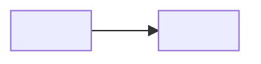

---
# Gabarit obligatoire d'un scénario (multi-technos, proche du réel). Copier, renseigner, ne pas réordonner.
titre: "<NN — Titre du scénario>"
numero: "<NN>"
technos:
  - "<techno 1>"
  - "<techno 2>"
niveau: "<débutant | confirmé | expert>"
prerequis:
  - "<fiches/<domaine>/<fiche>.md>"
  - "<scenarios/<NN-precedent>/README.md>"
duree_estimee: "<N h, en une ou plusieurs séances>"
lecture_max: "20 %"
profil_lab: "<linux-base | kubernetes-ha | openstack-kolla | ceph-3n | airgap>"
budget_lab: "<vCPU / Go RAM / Go disque, repris de labs/profiles/<profil>.yaml>"
versions: "<clés de versions.yaml utilisées>"
certifications:
  - "<CODE-DD-CC>"
praticable_sur_le_lab: "<oui | partiellement : sections marquées [lecture + simulation]>"
livrable: "<runbook | ADR | postmortem>"
solutions: "solutions/scenarios/<NN-nom>.md"
break_fix: "break/<domaine>/<nom-de-la-panne>.sh"
flashcards: "revision/flashcards/scenario-<NN-nom>.csv"
statut: "<brouillon | relu | validé en conditions réelles le AAAA-MM-JJ>"
---

# <NN — Titre du scénario>

> Niveau **<niveau>** · durée **<N h>** · profil de lab **<profil>** · couvre **<CODE-DD-CC, …>** · livrable **<runbook | ADR | postmortem>**.

## Contexte

<Situation réaliste en 5 lignes : qui demande quoi, contraintes, ce qui existe déjà sur le lab.>

## Objectifs mesurables

- <verbe d'action + résultat observable + contrainte de temps>
- <…>

## Architecture cible

<Adressage et VLAN repris de `labs/network.md`, jamais réinventés.>

## Étape 1 — <nom de l'étape>

Chaque étape suit le cycle ci-dessous, dans cet ordre, sans en sauter.

### Concept (court)

<Juste ce qu'il faut pour agir. Une manipulation suit dans les 10 lignes.>

### Démo guidée

<Commandes exécutées, sortie réelle ou `[non testé]` avec la raison.>

### Exercice autonome

<Énoncé seul. Indices et correction dans `solutions/`.>

Compétences couvertes : `<CODE-DD-CC>`, `<CODE-DD-CC>`.

### Break-fix

Script : `break/<domaine>/<nom-de-la-panne>.sh` — injecte la panne, `--undo` la retire.

<Symptôme observé. Pas la cause.>

### Défi chronométré

<Énoncé, temps imparti, critère de réussite vérifiable par une commande.>

## Étape 2 — <nom de l'étape>

<Même cycle : concept → démo guidée → exercice autonome → break-fix → défi chronométré.>

## Produire pour apprendre

<Le scénario se termine par un livrable rédigé par l'apprenant : runbook, ADR ou postmortem.
Gabarit minimal du livrable ici, à copier dans `journal/`.>

## Checklist de maîtrise

- [ ] Je sais déployer <architecture> de zéro en moins de <N> min avec `lab up <profil>`
- [ ] Je sais diagnostiquer <panne transverse> en moins de <N> min
- [ ] Je sais rédiger <livrable> en moins de <N> min

## Liens

- Solutions (3 indices puis correction commentée) : `solutions/scenarios/<NN-nom>.md`
- Pannes scriptées : `break/<domaine>/`
- Flashcards (10 à 20, CSV `question;réponse;tags`) : `revision/flashcards/scenario-<NN-nom>.csv`
- Mapping certification : `certifs/<CODE>/objectifs.md`
- Fiches de référence : `fiches/<domaine>/…`
